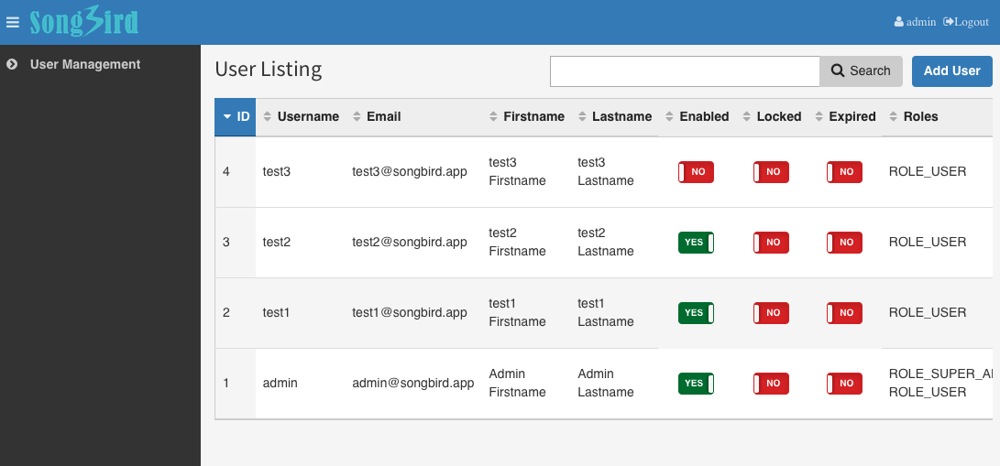

# Chapter 12: The Admin Panel Part 2

Let us continue with tweaking EasyAdmin by changing the layout and try more adventurous stuff like creating our own dashboard.

## Tweaking the UI

Its easy to change the theme colour and add our own custom css. For the sake of manageability, let us create a new file, design.yml

```
# app/config/easyadmin/design.yml

easy_admin:
  design:
    brand_color: '#5493ca'
    assets:
      css:
        - /bundles/app/css/style.css
```

and create a new css

```
# src/AppBundle/Resources/public/css/style.css

.user-menu a{
    color: rgba(255, 255, 255, 0.8);
}
```

Next, We will will overwrite layout.html.twig by copying it into our own views dir.

```
-> cp vendor/javiereguiluz/easyadmin-bundle/Resources/views/default/layout.html.twig app/Resources/EasyAdminBundle/views/default/
```

We will change the logo and top menu. The top menu will include a link to edit the user and logout.

```
# app/Resources/EasyAdminBundle/views/default/layout.html.twig

...


    <a class="logo {{ easyadmin_config('site_name')|length > 14 ? 'logo-long' }}" title="{{ easyadmin_config('site_name')|striptags }}" href="{{ path('easyadmin') }}">
        
    </a>

...

    <span class="sr-only">{{ 'user.logged_in_as'|trans(domain = 'EasyAdminBundle') }}</span>
    <i class="hidden-xs fa fa-user">
        
            <a href="{{ path('easyadmin') }}/?entity=User&action=show&id={{ app.user.id }}">{{ app.user.username|default('user.unnamed'|trans(domain = 'EasyAdminBundle')) }}</a>
        
            {{ 'user.anonymous'|trans(domain = 'EasyAdminBundle') }}
        
    </i>
    <i class="hidden-xs fa fa-sign-out"><a href="{{ path('fos_user_security_logout') }}">Logout</a></i>

```

Let us create the dashboard content.

```



<p>
    Dear {{ app.user.firstname }} {{ app.user.lastname }},
</p>
<p>
    You are last logged in at {{ app.user.lastLogin | date('Y-m-d H:i:s') }}
</p>

<p>
    The whole project can be forked from <a href="https://github.com/bernardpeh/songbird">github</a>
</p>


```

Noticed how I extended the layout.html.twig and just change the relevant blocks?

## Your Dashboard

Let us now create a new dashboard page via the standard way. We need a new route.

```
# src/AppBundle/Controller/AdminController.php

use Sensio\Bundle\FrameworkExtraBundle\Configuration\Route;
use Symfony\Component\HttpFoundation\Request;
...


    /**
     * @Route("/dashboard", name="dashboard")
     *
     * @param Request $request
     * @return \Symfony\Component\HttpFoundation\Response
     *
     */
    public function dashboardAction(Request $request)
    {
        return $this->render('@EasyAdmin/default/dashboard.html.twig');
    }
    ...
```

now copy the assets to the web dir from command line.

```
-> scripts/console assets:install --symlink
```

login and then refresh the browser.



## Menu Tweaking

Normal users should not see the left entities menus. Again, let us copy the menu.html.twig modify it.

```
-> cp vendor/javiereguiluz/easyadmin-bundle/Resources/views/default/menu.html.twig app/Resources/EasyAdminBundle/views/default/
```

and the actual menu.html.twig
```
# app/Resources/EasyAdminBundle/views/default/menu.html.twig

...



<ul class="sidebar-menu">
    
        
            
                <li class="{{ item.type == 'divider' ? 'header' }} {{ item.children is not empty ? 'treeview' }} {{ app.request.query.get('menuIndex')|default(-1) == loop.index0 ? 'active' }} {{ app.request.query.get('submenuIndex')|default(-1) != -1 ? 'submenu-active' }}">
                    {{ helper.render_menu_item(item, _entity_config.translation_domain|default('messages')) }}

                    
                        <ul class="treeview-menu">
                            
                                <li class="{{ subitem.type == 'divider' ? 'header' }} {{ app.request.query.get('menuIndex')|default(-1) == loop.parent.loop.index0 and app.request.query.get('submenuIndex')|default(-1) == loop.index0 ? 'active' }}">
                                    {{ helper.render_menu_item(subitem, _entity_config.translation_domain|default('messages')) }}
                                </li>
                            
                        </ul>
                    
                </li>
            
        
    
</ul>


```

This way of filtering menu access is rather *stupid* and serves just as an exercise for now. We will describe a better way to user manage our admin area in the later chapters. 

## Removing hardcoding of admin prefix

There is one more thing to mention before we end this chapter. At the moment, the admin url seems to be prefixed to '/admin/xx'. What if we want it to be a bit harder to guess, like 'admin9/xx'? This is a good security feature. Let us create a variable in the config.yml

```
# app/config/config.yml
...
parameters:
    admin_path: admin
    ...
```

We can now use this variable in other places. Once we change this variable, it will automatically update the prefix in all places for us.

```
# app/config/routing.yml
...
# easyadmin
easy_admin_bundle:
    resource: "@AppBundle/Controller/AdminController.php"
    type:     annotation
    prefix:   /%admin_path%

...
```

and

```
# app/config/security.yml
...
    firewalls:
        dev:
            pattern: ^/(_(profiler|wdt|error)|css|images|js)/
            security: false

        main:
            anonymous: ~
            pattern: ^/
            form_login:
                provider: fos_userbundle
                csrf_provider: security.csrf.token_manager
                default_target_path: /%admin_path%/dashboard
            logout:       true

    access_control:
        - { path: ^/login$, role: IS_AUTHENTICATED_ANONYMOUSLY }
        # We do not allow user registration
        # - { path: ^/register, role: IS_AUTHENTICATED_ANONYMOUSLY }
        - { path: ^/resetting, role: IS_AUTHENTICATED_ANONYMOUSLY }
        - { path: ^/%admin_path%/, role: ROLE_USER }
...
```

The default admin page is now default_target_path: /%admin_path%/dashboard

Try changing admin_path to something else and check if all the routes have been updated. Let's change the admin_path back to 'admin' after back.

## Update BDD Test (Optional)

Now that we have defined the admin layout, we should add new BDD tests to the dashboard cest to test on the dashboard and left menu.

|**Scenario Id**|**Given**|**When**|**Then**|
|10.1.2|See my dashboard content|I login correctly|I should not see the text "User Management" and should see the text "Dear test1"|
</table>

|**Scenario Id**|**Given**|**When**|**Then**|
|10.2.2|See my dashboard content|I login correctly|I should see the text "User Management" and "Dear Admin"|

Also with the left menu installed, we should be clicking on the links rather than going to the page directly. In all the "cest", replace all amOnPage methods to "click" method.

```
# go to page directly
$I->amOnPage('/admin/?action=list&entity=User');

# replace it with
$I->click('User Management');
```

Update all the tests to click on links rather than going to the url directly and I will leave this part to you. Once you are confident that all your tests are correct, run it and fix it till everything passes.

## Summary

In this chapter, we have touched up the admin area and created a simple dashboard block.

The admin area is now looking more polished.

## Exercises

* Try creating another url and view yourself. (Optional)

* Review and Update BDD for all admin and test1 user stories. (Optional)

## References

* [Twig Templating](http://symfony.com/doc/current/templating.html)