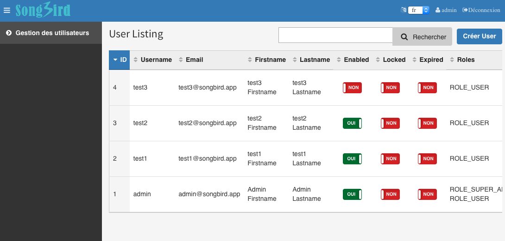

# Chapter 13: Internalisation

No CMS is complete with being being able to support multiple languages ([i18n](https://en.wikipedia.org/wiki/Internationalization_and_localization)). So far we have been typing english directly into the twig templates. This is quick and easy but its not the best practice. What if we are marketing our software to the french market? Wouldn't it be nice if the interface can be in french rather than english? Even though its time consuming to create translations for every term that we use, it is worth the effort if you want to make your software international.

What about [Google Translate](http://translate.google.com.au)? Google translate is never accurate and should not be used for professional purposes. Internalisation is something you want to work on early in the software development phase rather than later.

## Define User Story

**13. Internalisation**

|**Story Id**|**As a**|**I**|**So that I**|
|13.1|test1 user|want to be able to switch language|can choose my preferred language anytime.|

**Story ID 13.1: As a test1 user, I want to be able to switch language, so that I can choose my preferred language anytime.**

|**Scenario Id**|**Given**|**When**|**Then**|
|13.1.1|Locale in french|I login and switch language to french|I should be able to see the dashboard in french till I switched back to english|

## Translations for the AppBundle

let us create the translation files in the AppBundle. The naming convention for the file is domain.language_prefix.file_format, eg app.en.xlf.

```
# src/AppBundle/Resources/translations/app.en.xlf

<?xml version="1.0"?>
<xliff version="1.2" xmlns="urn:oasis:names:tc:xliff:document:1.2">
    <file source-language="en" datatype="plaintext" original="file.ext">
        <body>
            <trans-unit id="1">
                <source>dashboard.welcome.title</source>
                <target>Welcome to SongBird CMS</target>
            </trans-unit>
            <trans-unit id="2">
                <source>dashboard.welcome.credit</source>
                <target>The whole project can be forked from <![CDATA[
                <a href="https://github.com/bernardpeh/songbird">github</a>
                ]]></target>
            </trans-unit>
            <trans-unit id="3">
                <source>dashboard.welcome.last_login</source>
                <target>You last login at</target>
            </trans-unit>
        </body>
    </file>
</xliff>
```

Likewise, we need to create the translation file for french.

```
# src/AppBundle/Resources/translations/app.fr.xlf

<?xml version="1.0"?>
<xliff version="1.2" xmlns="urn:oasis:names:tc:xliff:document:1.2">
    <file source-language="en" datatype="plaintext" original="file.ext">
        <body>
            <trans-unit id="1">
                <source>dashboard.welcome.title</source>
                <target>Bienvenue à SongBird CMS</target>
            </trans-unit>
            <trans-unit id="2">
                <source>dashboard.welcome.credit</source>
                <target>L'ensemble du projet peut être fourchue de <![CDATA[
                <a href="https://github.com/bernardpeh/songbird">github</a>
                ]]></target>
            </trans-unit>
            <trans-unit id="3">
                <source>dashboard.welcome.last_login</source>
                <target>Vous dernière connexion au</target>
            </trans-unit>
        </body>
    </file>
</xliff>
```

## Update the Dashboard

How do we get the twig files to do the translation? You would have seen glimpse of it while working with the login files.

Let us update the dashboard template.

```
# app/Resources/easy_admin/dashboard.html.twig

...

<p>
    Dear {{ app.user.firstname }} {{ app.user.lastname }},
</p>
<p>
    {{ 'dashboard.welcome.last_login' | trans({}, 'app') }} {{ app.user.lastLogin | date('Y-m-d H:i:s') }}
</p>

<p>
    {{ 'dashboard.welcome.credit' | trans({}, 'app') | raw }}
</p>



```

refresh your browser and have a look. If things are not working, remember to clear the cache.

```
-> ./scripts/resetapp
```

By default, we are using english, so you should see that the english version is translated. To see all the translations in english for the AppBundle,

```
-> bin/console debug:translation en AppBundle
```

You should see a lot of missing translations for the FOSUserBundle. Don't worry about that for now.

Tip: Again, don't remember this command. Just type in "bin/console debug:translation" in the command line to see the options.

What about french? How do we set the locale? Just update the parameters in the config.yml

```
# app/config/config.yml
...
parameters:
    locale: fr
    admin_path: admin
...
```

Now refresh the dashboard and you should see the welcome block translated.

Its french. Viola!

How do we make the language dynamic? Perhaps we should have a selector on the top menu for users to select the language and persists throughout the session.

What about the menu?

Let us update the translation files

```
# app/Resources/translations/messages.fr.yml

admin.link.user_management: Gestion des utilisateurs
admin.link.profile: Mon profil
```

and

```
# app/Resources/translations/messages.en.yml

admin.link.user_management: User Management
admin.link.profile: My Profile
```

and

```
# app/config/easyadmin/user.yml
...
    entities:
        User:
            class: AppBundle\Entity\User
            label: admin.link.user_management
            ...
```

## Sticky Locale

Let us create the supported languages in config.yml
```
# app/config/config.yml

...
parameters:
    # set this to english as default
    locale: en
    supported_lang: [ 'en', 'fr']
    admin_path: admin
...
twig:
    debug:            "%kernel.debug%"
    strict_variables: "%kernel.debug%"
    globals:
        supported_lang: %supported_lang%
...
```

We have created a variable called supported_lang (consisting of an array) and passed it to twig as a global variable.

Now in the layout twig

```
# app/Resources/easy_admin/layout.html.twig

...

    {{ 'dashboard.welcome.title' | trans({}, 'app') }}





    {{ parent() }}
    <script>
        $(function() {
            // select the box based on locale
            $('#lang').val('{{ app.request.getLocale() }}');
            // redirect user if user change locale
            $('#lang').change(function() {
                window.location='{{ urlPrefix }}'+$(this).val()+'/locale';
            });
        });
    </script>



    <i class="fa fa-language" aria-hidden="true">
        <select id="lang" name="lang">
            
                <option value="{{ lang }}">{{ lang }}</option>
            
        </select>
    </i>
    <i class="hidden-xs fa fa-user">
    
        <a href="{{ path('easyadmin') }}/?entity=User&action=show&id={{ app.user.id }}">{{ app.user.username|default('user.unnamed'|trans(domain = 'EasyAdminBundle')) }}</a>
    
        {{ 'user.anonymous'|trans(domain = 'EasyAdminBundle') }}
    
        </i>
    <i class="hidden-xs fa fa-sign-out"><a href="{{ path('fos_user_security_logout') }}">Logout</a></i>

```

Note that we have made logic and css tweaks to the top nav. The new CSS is as follows:

```
# src/AppBundle/Resources/public/css/styles.css

.user-menu a{
    color: rgba(255, 255, 255, 0.8);
}

i {
    padding: 5px;
}

#lang {
    color: #333;
}

```

The new language dropdown box allows user to select a language and if there is a change in the selection, the user is redirected to a url /{_locale}/locale where the change of locale magic is supposed to happen.

and create a new controller from the command line.

```
-> bin/console generate:controller --controller=AppBundle:Locale -n
```

and the controller code in full:

```
# src/AppBundle/Controller/LocaleController.php

namespace AppBundle\Controller;

use Symfony\Bundle\FrameworkBundle\Controller\Controller;
use Sensio\Bundle\FrameworkExtraBundle\Configuration\Route;
use Symfony\Component\HttpFoundation\Request;
use Sensio\Bundle\FrameworkExtraBundle\Configuration\Method;

class LocaleController extends Controller
{
    /**
     * Redirects user based on their referer
     *
     * @Route("/{_locale}/locale", name="app_set_locale")
     * @Method("GET")
     */
    public function setLocaleAction(Request $request, $_locale)
    {
        $auth_checker = $this->get('security.authorization_checker');

        // if referrer exists, redirect to referrer
        $referer = $request->headers->get('referer');
        if ($referer) {
            return $this->redirect($referer);
        }
        // if logged in, redirect to dashboard
        elseif ($auth_checker->isGranted('ROLE_USER')) {
            return $this->redirectToRoute('dashboard');
        }
        // else redirect to homepage
        else {
            return $this->redirect('/');
        }
    }
}
```

As you can see, the annotation defines the the new route /{_locale}/locale. To make sure that this route is working,

```
-> bin/console debug:router | grep locale
 app_set_locale                          GET      ANY    ANY  /{_locale}/locale
```

The AdminController gets the request object and redirects the user to the referer if there is one. If not, it redirects the user to either the admin dashboard or the homepage depending if the user is logged in or not. Again, don't memorise security.authorization_checker. Google around, make intelligent guesses and use the command line to verify the containers.

```
-> bin/console debug:container | grep security
...
```

We said that the controller is the place where magic happens... but where is the magic? We haven't even change the locale session yet! We cannot change it at the controller level because it is too late. We have to change it very early on in the [Http workflow](http://symfony.com/doc/current/components/http_kernel/introduction.html)

Basically, what we need to do is to hook on to the kernel.request event and modify some logic there. The symfony cookbook has good information on [sticky sessions](http://symfony.com/doc/current/cookbook/session/locale_sticky_session.html).

We have create an event subscriber before. Let us create an event listener this time round.

```
# src/AppBundle/Resources/config/services.yml

...
  app.locale.listener:
    class: AppBundle\EventListener\LocaleListener
    arguments:
      - "%kernel.default_locale%"
    tags:
      - { name: kernel.event_listener, event: kernel.request, priority: 17 }
...
```

Why did we use priority 17? Every listener has a priority. The higher the priority, the earlier the listener will be executed. We want our custom LocaleListener to be earlier than the Kernel's LocaleListener. According to [Kernel events](http://symfony.com/doc/current/reference/events.html), The kernel LocaleListener has priority 16. Let us go abit higher, ie 17.

Now we need to create the LocaleListener class.

```
# src/AppBundle/EventListener/LocaleListener.php

namespace AppBundle\EventListener;

use Symfony\Component\HttpKernel\Event\GetResponseEvent;
use Symfony\Component\HttpFoundation\RedirectResponse;

class LocaleListener
{
    private $defaultLocale;

    public function __construct($defaultLocale = 'en')
    {
        $this->defaultLocale = $defaultLocale;
    }

    public function onKernelRequest(GetResponseEvent $event)
    {
        $request = $event->getRequest();
        if (!$request->hasPreviousSession()) {
            return;
        }

        // try to see if the locale has been set as a _locale routing parameter
        if ($locale = $request->attributes->get('_locale')) {
            $request->getSession()->set('_locale', $locale);
        } else {
            // if no explicit locale has been set on this request, use one from the session
            $request->setLocale($request->getSession()->get('_locale', $this->defaultLocale));
        }
    }
}
```

To see what is going on with the events sequencing,

```
# now view the event dispatcher list
-> bin/console debug:event-dispatcher kernel.request
```

Look at the kernel.request section and you should see our custom event listener ranked 7, just above the kernel LocaleListener.

Can you use the AppSubscriber class that we have created to do the same job?


Now, clear the cache and refresh the browser. Try changing the locale dropdown and see for yourself.

```
-> ./scripts/resetapp
```


Try changing the priority to 15 of kernel.event_listener tag and see what happens?

## Update BDD (Optional)

Let us create the cest file based on the User Story.

```
-> vendor/bin/codecept generate:cest acceptance As_Test1_User/IWantToSwitchLanguageCest -c src/AppBundle
```

now within the cest file:

```
#src/AppBundle/Tests/acceptance/As_Test1_User/IWantToSwitchLanguageCest.php

namespace As_Test1_User;
use \AcceptanceTester;
use \Common;

class IWantToSwitchLanguageCest
{
    public function _before(AcceptanceTester $I)
    {
        Common::login($I, TEST1_USERNAME, TEST1_PASSWORD);
    }

    public function _after(AcceptanceTester $I)
    {
    }

    /**
     * Scenario 13.1.1
     */
    public function localeInFrench(AcceptanceTester $I)
    {
        // switch to french
        $I->selectOption('//select[@id="lang"]', 'fr');
        // I should be able to see "my profile" in french
        $I->canSee('Déconnexion');
        $I->click('test1');
        // now in show profile page
        $I->canSee("Éditer");
        // now switch back to english
        $I->selectOption('//select[@id="lang"]', 'en');
        $I->canSee('Edit');
    }
}
```

Lets run the test to make sure everything is working.

```
-> ./scripts/runtest As_Test1_User/IWantToSwitchLanguageCest.php
```

Since the UI has been changed, some previous BDD tests might fail. Fix them and re-run the full BDD tests till everything passes.

```
-> ./scripts/runtest
```

## Summary

In this chapter, we learned how to create translation files and updated the twig files to handle the translation. We have also created a language switcher in the admin area and added a new BDD test to test internalisation.

I am not french and my french translation might not be correct as I was using google translate. The use of french in this book is just an example.

Remember to commit all your changes before moving on to the next chapter.

## Exercises

* Remember all the twig files you have created in [chapter 11](https://github.com/bernardpeh/songbird/tree/chapter_11)? Update them to support i18n.

* (Optional) Try creating translations in other languages other than french.

## References

* [Symfony translations](http://symfony.com/doc/current/book/translation.html)

* [Translations best practices](http://symfony.com/doc/current/best_practices/i18n.html)

* [Sticky Session](http://symfony.com/doc/current/cookbook/session/locale_sticky_session.html)

* [Kernel Events](http://symfony.com/doc/current/reference/events.html)

* [EasyAdmin Translations](https://github.com/javiereguiluz/EasyAdminBundle/blob/master/Resources/doc/tutorials/i18n.md)
