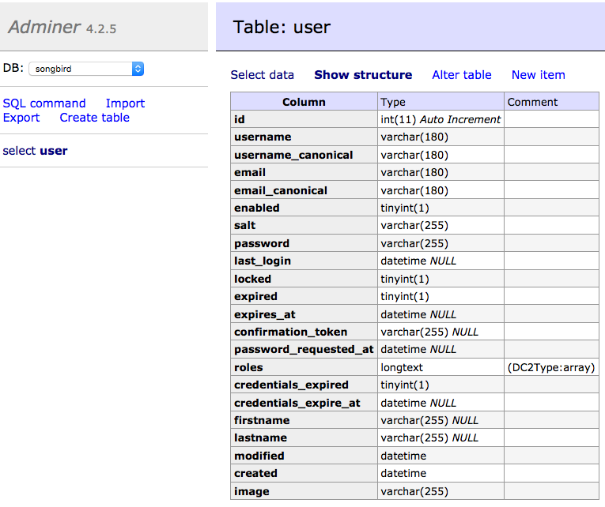

# Chapter 14: Uploading Files

Our CMS should allow uploading of files. Let's say we want to allow user to upload their own profile image. EasyAdmin has nice integration with a popular bundle called [VichUploaderBundle](https://github.com/dustin10/VichUploaderBundle).

## Update User Stories

**Story ID 10.6: As an admin user, I want to manage all users, so that I can control user access of the system.**

|**Scenario Id**|**Given**|**When**|**Then**|
|10.6.1|List all profiles|I go show profile page" url|I should see a list of all users in a table with image fields|

**Story ID 10.1: As a test1 user, I want to manage my profile, so that I can update it any time.**

|**Scenario Id**|**Given**|**When**|**Then**|
|10.4.1|Show my profile|I go to show profile page|I should see test1@songbird.app and an Image field|
|10.4.5|Delete and Add profile image|I go to edit profile page And delete profile image and add a new image|I should see an empty profile, previous profile image gone and then a new one appearing in the file system.|
|10.4.6|Update profile image Only|I go to edit profile page And update profile image and submit|I should see user profile updated and previous profile image gone from file system.|

## Install Vich Uploader Bundle

Add the vich uploaded bundle to composer

```
-> composer require vich/uploader-bundle ^1.2
```

In config.yml, we need to add a few parameters

```
# app/config/config.yml
...
parameters:
    locale: en
    supported_lang: [ 'en', 'fr']
    admin_path: admin
    app.profile_image.path: /uploads/profiles
    ...
# Vich Configuration
vich_uploader:
    db_driver: orm
    mappings:
        profile_images:
            uri_prefix: '%app.profile_image.path%'
            upload_destination: '%kernel.root_dir%/../web/uploads/profiles'
            # this will allow all uploaded filenames to be unique
            namer: vich_uploader.namer_uniqid
...
```

and in Appkernel.php

```
# app/AppKernel.php
...
public function registerBundles()
{
    return array(
        // ...
        new Vich\UploaderBundle\VichUploaderBundle(),
    );
}
...
```


let us reset the app

```
-> ./scripts/resetapp
```

go to adminer and verify that the new image field has been added.




We need to create the new upload folder

```
-> mkdir -p web/uploads/profiles
```

but we should ignore in git. In .gitignore

```
# .gitignore
/web/bundles/
/web/uploads/
/app/bootstrap.php.cache
/app/cache/*
/app/config/parameters.yml
/app/logs/*
!app/cache/.gitkeep
!app/logs/.gitkeep
/app/phpunit.xml
/build/
/vendor/
/bin/
/composer.phar
/composer.lock

src/AppBundle/tests/_output/*
```

## Update Fixtures

Let us update the Image field to help us with automate testing.

```
# src/AppBundle/DataFixtures/ORM/LoadUserData.php

...
    public function load(ObjectManager $manager)
        {
            $userManager = $this->container->get('fos_user.user_manager');

            // add admin user
            $admin = $userManager->createUser();
            $admin->setUsername('admin');
            $admin->setEmail('admin@songbird.app');
            $admin->setPlainPassword('admin');
            $userManager->updatePassword($admin);
            $admin->setEnabled(1);
            $admin->setFirstname('Admin Firstname');
            $admin->setLastname('Admin Lastname');
            $admin->setRoles(array('ROLE_SUPER_ADMIN'));
            $admin->setImage('test_profile.jpg');
            $userManager->updateUser($admin);

            // add test user 1
            $test1 = $userManager->createUser();
            $test1->setUsername('test1');
            $test1->setEmail('test1@songbird.app');
            $test1->setPlainPassword('test1');
            $userManager->updatePassword($test1);
            $test1->setEnabled(1);
            $test1->setFirstname('test1 Firstname');
            $test1->setLastname('test1 Lastname');
            $test1->setImage('test_profile.jpg');
            $userManager->updateUser($test1);

            // add test user 2
            $test2 = $userManager->createUser();
            $test2->setUsername('test2');
            $test2->setEmail('test2@songbird.app');
            $test2->setPlainPassword('test2');
            $userManager->updatePassword($test2);
            $test2->setEnabled(1);
            $test2->setFirstname('test2 Firstname');
            $test2->setLastname('test2 Lastname');
            $test2->setImage('test_profile.jpg');
            $userManager->updateUser($test2);

            // add test user 3
            $test3 = $userManager->createUser();
            $test3->setUsername('test3');
            $test3->setEmail('test3@songbird.app');
            $test3->setPlainPassword('test3');
            $userManager->updatePassword($test3);
            $test3->setEnabled(0);
            $test3->setFirstname('test3 Firstname');
            $test3->setLastname('test3 Lastname');
            $test3->setImage('test_profile.jpg');
            $userManager->updateUser($test3);

            // use this reference in data fixtures elsewhere
            $this->addReference('admin_user', $admin);
        }
    ...
```

We will update the resetapp script to copy the test_profile.jpg to the web folder

```
# scripts/resetapp

#!/bin/bash
rm -rf var/cache/*
# bin/console cache:clear --no-warmup
bin/console doctrine:database:drop --force
bin/console doctrine:database:create
bin/console doctrine:schema:create
bin/console doctrine:fixtures:load -n

# copy test data over to web folder
cp src/AppBundle/Tests/_data/test_profile.jpg web/uploads/profiles/
```

## Update UI

Let us update the UI to include the image field.

```
# app/config/easyadmin/user.yml

easy_admin:
    design:
        brand_color: '#337ab7'
        assets:
            css:
              - /bundles/app/css/style.css

    entities:
        User:
            class: AppBundle\Entity\User
            label: admin.link.user_management
            # for new user
            new:
                fields:
                  - username
                  - firstname
                  - lastname
                  - { property: 'plainPassword', type: 'repeated', type_options: { type: 'Symfony\Component\Form\Extension\Core\Type\PasswordType', first_options: {label: 'Password'}, second_options: {label: 'Repeat Password'}, invalid_message: 'The password fields must match.'}}
                  - { property: 'email', type: 'email', type_options: { trim: true } }
                  - { property: 'imageFile', type: 'vich_image' }
                  - roles
                  - enabled
            edit:
                  actions: ['-delete', '-list']
                  fields:
                    - username
                    - firstname
                    - lastname
                    - { property: 'plainPassword', type: 'repeated', type_options: { type: 'Symfony\Component\Form\Extension\Core\Type\PasswordType', required: false, first_options: {label: 'Password'}, second_options: {label: 'Repeat Password'}, invalid_message: 'The password fields must match.'}}
                    - { property: 'email', type: 'email', type_options: { trim: true } }
                    - { property: 'imageFile', type: 'vich_image' }
                    - roles
                    - enabled
                    - locked
                    - expired
            show:
                  actions: ['edit', '-delete', '-list']
                  fields:
                    - id
                    - { property: 'image', type: 'image', base_path: '%app.profile_image.path%'}
                    - username
                    - firstname
                    - lastname
                    - email
                    - roles
                    - enabled
                    - locked
                    - expired
                    - { property: 'last_login', type: 'datetime' }
                    - modified
                    - created
            list:
                title: 'User Listing'
                actions: ['show']
                fields:
                  - id
                  - { property: 'image', type: 'image', base_path: '%app.profile_image.path%'}
                  - username
                  - email
                  - firstname
                  - lastname
                  - enabled
                  - locked
                  - expired
                  - roles
                  - { property: 'last_login', type: 'datetime' }
```

Let us resetapp and have a look

```
-> ./scripts/resetapp
```
## Update BDD (Optional)

In this chapter, we might need other modules like Db and Filesystem. Let us update our acceptance config file

```
# src/AppBundle/Tests/acceptance.suite.yml

class_name: AcceptanceTester
modules:
    enabled:
        - WebDriver:
            url: 'http://songbird.app'
            browser: chrome
            window_size: 1024x768
            capabilities:
                unexpectedAlertBehaviour: 'accept'
                webStorageEnabled: true
        - MailCatcher:
            url: 'http://songbird.app'
            port: '1080'
        - FileSystem:
        - Db:
        - \Helper\Acceptance
```

and our db credentials

```
# src/AppBundle/codeception.yml

actor: Tester
paths:
    tests: Tests
    log: Tests/_output
    data: Tests/_data
    support: Tests/_support
    envs: Tests/_envs
settings:
    bootstrap: _bootstrap.php
    colors: true
    memory_limit: 1024M
extensions:
    enabled:
        - Codeception\Extension\RunFailed
modules:
    config:
        Db:
            dsn: 'mysql:host=192.168.56.111;dbname=songbird'
            user: 'homestead'
            password: 'secret'
            dump: Tests/_data/dump.sql
```

now run the build to update the acceptance library

```
-> vendor/bin/codecept build -c src/AppBundle
```

You should now have lots of new functions to use in AcceptanceTesterActions.php.

Write the stories in this chapter as a practice. Again, get all the test to pass before moving to the next chapter.

> Tip: To test a file upload, put a file under src/AppBundle/Tests/_data folder and you can then use the attachFile function like so

```
$I->waitForElementVisible('//input[@type="file"]');
$I->attachFile('//input[@type="file"]', 'testfile.png');
$I->click('Submit');
```

Remember to commit everything before moving on to the next chapter.

## Summary

In this chapter, we have integrated VichuploadBundle with EasyAdminBundle. We made minor change to the ui and added new BDD tests.

## Exercises

* Integrate [SonataMediaBundle](https://sonata-project.org/bundles/media/master/doc/index.html) instead. (Optional)

* Write BDD Test for User stories in this chapter. (Optional)

## References

* [EasyAdmin Vich Uploader](https://github.com/bernardpeh/EasyAdminBundle/blob/master/Resources/doc/tutorials/upload-files-and-images.md)