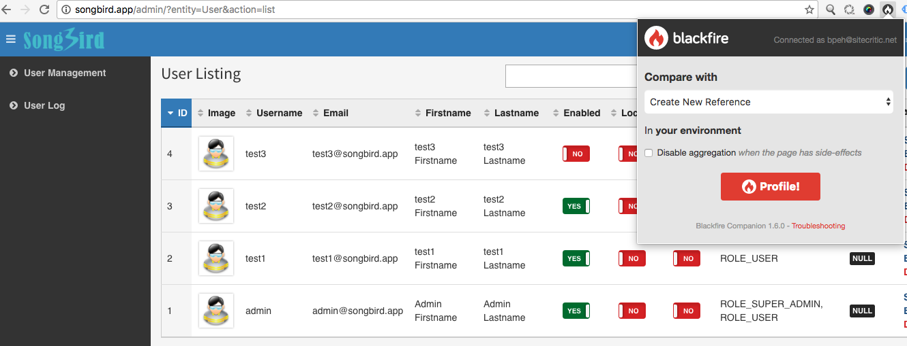
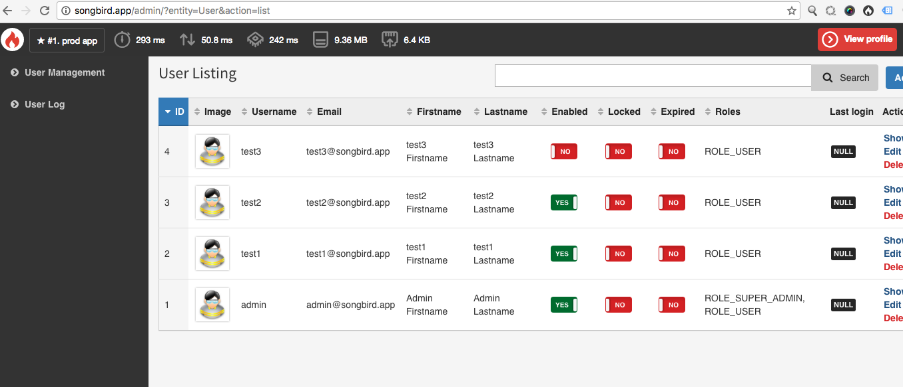
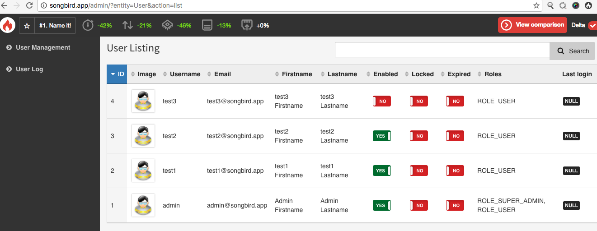
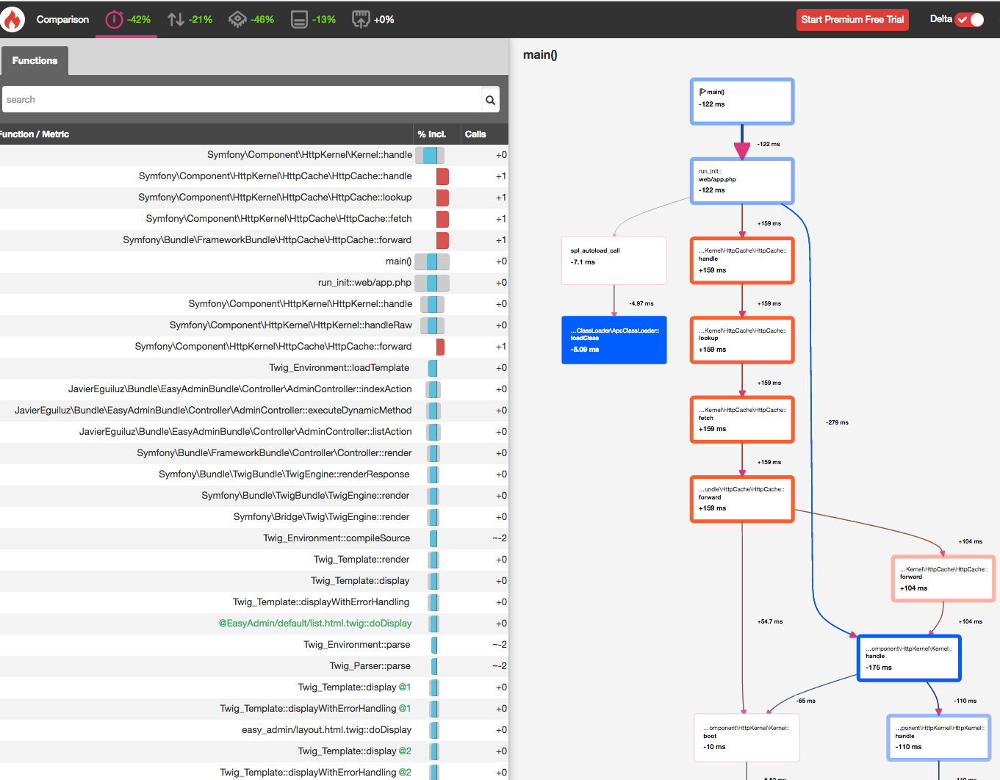

# Chapter 16: Improving Performance and Troubleshooting

If your site uses a lot of javascript and css, one good optimisation strategy is to merge the css and js into just one file each. That way, its one http request rather multiple, improving the loading time. There are also tools to find out where bottlenecks are and fix them.

## Install Blackfire

Head to [blackfire.io](http://blackfire.io) (another great product by sensiolabs) and sign up for an account. In https://blackfire.io/account, get the client and server (id and token). Enter them in .env.

We only need to configure blackfire.

```
# .env
# Blackfire io
BLACKFIRE_SERVER_ID=your_id
BLACKFIRE_SERVER_TOKEN=your_id
```

Let us add the blackfire image to docker-compose. 

```
...
    blackfire:
       image: blackfire/blackfire
       environment:
            - BLACKFIRE_SERVER_ID=${BLACKFIRE_SERVER_ID}
            - BLACKFIRE_SERVER_TOKEN=${BLACKFIRE_SERVER_TOKEN}
       networks:
           mynet:
               ipv4_address: 172.25.0.7
...               
```

and bring up the image

```
-> docker-compose down
-> docker-compose up -d
```

## Upgrade ResetApp Script

./scripts/resetapp is a script that we invoke when we want to remove the cache and reset the database. It is often called if we make changes to the template or before we run test suites. To increase the efficiency of the script, we should allow user to specify if resetting the app requires deleting the cache or not as cache generation is an expensive process and the lag time can cause inconsistency in the tests.

What we need is a an optional switch to allow deleting or cache or not. Maybe even allow an option to load fixtures or not.

```
# scripts/resetapp

#!/bin/bash

usage()
{
cat << EOF

usage: $0 [options]

This script clears the cache, resets the db and install the fixtures

OPTIONS:
   -f      Don't load fixtures
   -c      Don't clear cache (for all env)
EOF
exit 1
}

CLEAR_CACHE=1
LOAD_FIXTURES=1
while getopts "cf" o; do
    case "${o}" in
        c)
            CLEAR_CACHE=
            ;;
        f)
            LOAD_FIXTURES=
            ;;
        *)
            usage
            ;;
    esac
done

if [[ $CLEAR_CACHE ]]
then
    rm -rf app/cache/*
    # bin/console cache:clear --env=prod --no-warmup
fi

scripts/console doctrine:database:drop --force
scripts/console doctrine:database:create
scripts/console doctrine:schema:create

if [[ $LOAD_FIXTURES ]]
then
    scripts/console doctrine:fixtures:load -n
fi

# copy test data over to web folder
cp src/AppBundle/tests/_data/test_profile.jpg web/uploads/profiles/
```

We will now use the "resetapp -c" instead to clear the db only when resetting tests.

```
# scripts/runtest

#!/bin/bash
scripts/resetapp -c
docker-compose exec php vendor/bin/codecept run acceptance $@ -c src/AppBundle
```

## Optimising Composer

We can also optimise composer by building an optimised class map to help speed up searching for namespaces. We can run this once during deployment to production.

```
# scripts/optimize_composer

#!/bin/bash

# optimise composer
scripts/composer dump-autoload --optimize --no-dev --classmap-authoritative
```

## Minimising JS/CSS

You might have heard of using assetic to manage assets and minimising JS/CSS from [The book](http://symfony.com/doc/current/cookbook/assetic/asset_management.html) and [The Cookbook](http://symfony.com/doc/current/cookbook/assetic/index.html). The nice thing about using assetic is that you can do compilation of [sass](http://sass-lang.com) or [less](http://lesscss.org) files on the fly. If you are unsure about css preprocessor, I recommend checking them out. At the time of writing, sass is more popular.

The has been a lot of innovation in frontend technologies especially with node in recent years. [gulpjs](http://gulpjs.com) is being widely to minify js and css.

Assuming you are using mac, make sure you have homebrew. If not, install it

```
-> ruby -e "$(curl -fsSL https://raw.githubusercontent.com/Homebrew/install/master/install)"
```

Install node if not done.

```
-> brew install node
```

If successful, "node -v" and "npm -v" should return values. Now we create package.json.

```
# in symfony folder
-> npm init
name: (songbird)
version: (1.0.0)
description: gulp config
entry point: (index.js) gulpfile.js
test command:
git repository:
keywords:
author:
license: (ISC)
```

Follow through the prompts. Then install bower.

```
-> sudo npm install -g bower
```

Like npm, let us create the bower.json

```
-> bower init
```

Like before, follow through the prompts. Now, let us install all the bower dependencies.

```
-> bower install jquery bootstrap --save-dev
```

Jquery and bootstrap are the 2 most widely used libraries. It make sense for us to include the libraries outside of AppBundle.

Let us install gulp and all the dependencies.

```
# in symfony folder
-> npm install gulp gulp-util gulp-cat gulp-uglify gulp-uglifycss gulp-less gulp-sass gulp-concat gulp-sourcemaps gulp-if --save
```

if everything is successful, we should see these new files and folders:

```
bower.json
/bower_components
package.json
/node_modules
```

We only need the json files, we can put the bower_components and node_modules in .gitignore

```
# .gitignore
...
/node_modules
/bower_components
...
```

package.json is important. We want the default node js file to be gulpfile.js. The package.json should look something like this:

```
# package.json
{
  "name": "songbird",
  "version": "1.0.0",
  "description": "gulp config",
  "main": "gulpfile.js",
  "scripts": {
    "test": "echo \"Error: no test specified\" && exit 1"
  },
  "author": "",
  "license": "ISC",
  "dependencies": {
    "gulp": "^3.9.1",
    "gulp-cat": "^0.3.3",
    "gulp-concat": "^2.6.0",
    "gulp-if": "^2.0.1",
    "gulp-less": "^3.1.0",
    "gulp-sass": "^2.3.2",
    "gulp-sourcemaps": "^1.6.0",
    "gulp-uglify": "^2.0.0",
    "gulp-uglifycss": "^1.0.6",
    "gulp-util": "^3.0.7"
  }
}


```

Let us create the gulpfile.js

```
# gulpfile.js
var gulp = require('gulp');
var gulpif = require('gulp-if');
var uglify = require('gulp-uglify');
var uglifycss = require('gulp-uglifycss');
var less = require('gulp-less');
var sass = require('gulp-sass');
var concat = require('gulp-concat');
var sourcemaps = require('gulp-sourcemaps');
var exec = require('child_process').exec;

// Minify JS
gulp.task('js', function () {
    return gulp.src(['bower_components/jquery/dist/jquery.js',
        'bower_components/bootstrap/dist/js/bootstrap.js'])
        .pipe(concat('javascript.js'))
        .pipe(uglify())
        .pipe(sourcemaps.write('./'))
        .pipe(gulp.dest('web/minified/js'));
});

// Minify CSS
gulp.task('css', function () {
    return gulp.src([
        'bower_components/bootstrap/dist/css/bootstrap.css',
        'src/AppBundle/Resources/public/less/*.less',
        'src/AppBundle/Resources/public/sass/*.scss',
        'src/AppBundle/Resources/public/css/*.css'])
        .pipe(gulpif(/[.]less/, less()))
        .pipe(gulpif(/[.]scss/, sass()))
        .pipe(concat('styles.css'))
        .pipe(uglifycss())
        .pipe(sourcemaps.write('./'))
        .pipe(gulp.dest('web/minified/css'));
});

// Copy Fonts
gulp.task('fonts', function() {
    return gulp.src('bower_components/bootstrap/fonts/*.{ttf,woff,woff2,eof,svg}')
    .pipe(gulp.dest('web/minified/fonts'));
});

gulp.task('installAssets', function() {
    exec('./scripts/console assets:install --symlink', logStdOutAndErr);
});

//define executable tasks when running "gulp" command
gulp.task('default', ['js', 'css', 'fonts', 'installAssets']);

gulp.task('watch', function () {
    var onChange = function (event) {
        console.log('File '+event.path+' has been '+event.type);
    };
    gulp.watch('src/AppBundle/Resources/public/js/*.js', ['default'])
        .on('change', onChange);

    gulp.watch('src/AppBundle/Resources/public/less/*.less', ['default'])
        .on('change', onChange);

    gulp.watch('src/AppBundle/Resources/public/sass/*.scss', ['default'])
        .on('change', onChange);

    gulp.watch('src/AppBundle/Resources/public/css/*.css', ['default'])
        .on('change', onChange);
});

// show exec output
var logStdOutAndErr = function (err, stdout, stderr) {
    console.log(stdout + stderr);
};

```

In short, this gulpfile.js simply says minify all relevant js and css, then copy the js, css and fonts to the web/minified directory.

Since we are only using 1 css and js file, we only need to include the files once in the base template.


```
#  src/AppBundle/Resources/views/base.html.twig
....

    <link href="{{ asset('minified/css/styles.css') }}" rel="stylesheet" />

...

    <script src="{{ asset('minified/js/javascript.js') }}"></script>

...
```

We no longer need to use separate css for the custom views. Remove all the stylesheet blocks in src/AppBundle/Resources/FOSUserBundle/views/Resetting and src/AppBundle/Resources/FOSUserBundle/views/Security.


Let us update gitignore:

```
# .gitignore
...
/web/minified/
...
```

and create the minified dir

```
mkdir -p web/minified
```

Since we are using bower to include common js and css, we can remove all the unncessary css and js that we have included from the previous chapters.

```
git rm src/AppBundle/Resources/public/css/bootstrap*
```

To compile the js and css, open up another terminal and enter

```
-> gulp
```

if you want to auto compile js or css files when you change the sass or javascript files

```
-> gulp watch
```

If everything is successful, you will see the new dir and files created under web/minified dir.

Now go to songbird.app/login, and verify the new javascript.js and styles.css are included by viewing the source code.

## Troubleshooting

You should by now aware of the debug toolbar (profiler) at the bottom of the screen as you access the app_dev.php/* url. The toolbar provide lots of debugging information for the application like the route name, db queries, render time, memory usage, translation...etc.

If you have been observant enough, you should have seen the red alert on the toolbar. Try logging in as admin and go to http://songbird.app:8000/app_dev.php/admin/?entity=User&action=list and look at the toolbar. What happened?

You would see the obvious alert icon in the toolbar... Clicking on the red icon will tell you that you have missing translations.

There will be lots of "messages" under the domain column if there is no translation for certain text.

How would you fix the translation errors? 

How about the performance link? What can you see from there?

Using the debug toolbar is straight forward and should be self explanatory.

> Tip: PHP developers should be aware of the print_r or var_dump command to dump objects or variables. Try doing it with Symfony and your browser will crash. In PHP, use [var_dumper](http://symfony.com/doc/current/components/var_dumper/introduction.html) and in twig, use [dump](http://twig.sensiolabs.org/doc/functions/dump.html) instead.


## Identifying bottlenecks with blackfire.io

Even though the in-built debug profiler can provide the rendering time and performance information but it doesn't go into detail where the bottlenecks are. To find out where the bottlenecks are, we need Blackfire.

*You should have installed blackfire from the previous section.*

To make use of Blackfire is easy, install the [google chrome companion extension](https://blackfire.io/docs/integrations/chrome).

Once done, you should see a new blackfire icon on the top right of google chrome. Let us load the user management page:

```
http://songbird.app:8000/admin/?entity=User&action=list

```



and click "create a new reference", then click on on the Profile button.

At this point, the chrome browser will interact with the php docker container and tells the blackfire agent to pass the diagnostic data over to blackfire server. You will also see some values in the blackfire toolbar. So we are talking about a few sec of processing time. This is slow and thats because we are using docker.



Once done, you will see a new profile toolbar. Give the profile a name, say "songbird prod default".

We will do another optimisation for the sake of illustration. Symfony comes with a reverse proxy, let us enable it.

```
# web/app.php

use Symfony\Component\HttpFoundation\Request;
use Symfony\Component\ClassLoader\ApcClassLoader;

/**
 * @var Composer\Autoload\ClassLoader
 */
$loader = require __DIR__.'/../app/autoload.php';
include_once __DIR__.'/../app/bootstrap.php.cache';

$apcLoader = new ApcClassLoader(sha1('songbird'), $loader);
$loader->unregister();
$apcLoader->register(true);

$kernel = new AppKernel('prod', true);
$kernel->loadClassCache();
$kernel = new AppCache($kernel);

// When using the HttpCache, you need to call the method in your front controller instead of relying on the configuration parameter
Request::enableHttpMethodParameterOverride();
$request = Request::createFromGlobals();
$response = $kernel->handle($request);
$response->send();
$kernel->terminate($request, $response);
```

Now refresh the page and then click on the blackfire icon again. In the blackfire toolbar, compare it with the previous profile.



Did you see any improvements in the loading time. What was the improvement?

Click on "View comparision"



As you would expect, it should be clear where the bottleneck was huh? See the blue lines...

I was merely scrapping the surface of blackfire. I suggest you do the [24 days of blackfire](https://blackfire.io/docs/24-days/index) tutorials if you want to dig in deeper.

## Fix Coding Standards with PHP-CS-Fixer

[PHP-CS-Fixer](https://github.com/FriendsOfPHP/PHP-CS-Fixer) automatically fixes coding standards. Its always a good idea to use it to clean up your code before commiting.

 ```
 -> ./scripts/composer require friendsofphp/php-cs-fixer --dev
 ```
 
 once this php-cs-fixer is installed, we can use it from the command line like so
 
 ```
 -> ./vendor/bin/php-cs-fixer fix app/
       1) AppKernel.php
       2) autoload.php
    Fixed all files in 0.914 seconds, 7.000 MB memory used
 ```
 
 Let us add the php-cs-fixer cache dir to .gitignore as well
 
 ```
 # .gitignore
 ...
 .php_cs.cache
 ```
 
 Do it for the src directory as well. Run all the tests. We can now commit all the fixed files once we are happy with the results.
 
## Summary

In this chapter, we briefly discussed several optimisation strategies. We installed blackfire, minified css and js using gulpjs. We have also refactored the runtest script so that it doesn't clear the cache every time it starts a new test. lastly, we walked through troubleshooting using the web toolbar and blackfire.io.

## Exercises

* Using the debug profiler, fix all the translation errors.

* What other performance enhancing tools can you think of?

* Try minimising the js and css in the admin area?

## References

* [Improving Symfony Performance](http://symfony.com/doc/current/book/performance.html)

* [Symfony gateway cache](http://symfony.com/doc/current/book/http_cache.html)

* [24 days of blackfire](https://blackfire.io/docs/24-days/index)