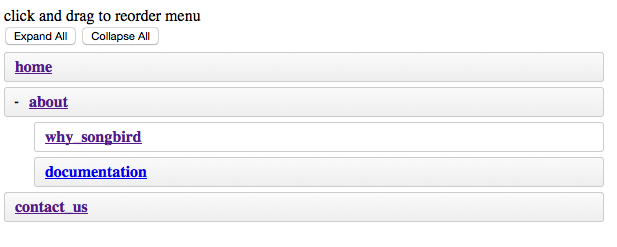

# Chapter 17: The Page Manager Part 1

So far, we have been very lazy (a good thing?). We have offloaded bulk of the CMS functionality to FOS and EasyAdmin bundles. In this chapter, we will create a simple **reusable** page bundle and the bulk of the logic ourselves. Let us call this NestablePageBundle.

## The Plan

To be truly **decoupled** from the rest of the bundles, we want our page bundle to have no dependency on other bundles like FOSbundles. Each page should have a unique slug and a couple of meta data such as title, short description, long description, created_date...etc. We will be using [nestable js](https://github.com/BeFiveINFO/Nestable) to allow drag and drop + page nesting using ajax.

We will create 2 entities. The first entity is the Page entity and will consist of simple attributes like id, slug, sequence, parent and children id...etc. The second entity will be the PageMeta entity consisting of attributes like name, locale, title, short description and content. The relationship between the Page and PageMeta entity will be one to many.

This bundle creation is for **illustration only** and has lots of rooms for improvement.

## Define User Stories

Since SongbirdNestableBundle is going to be decoupled from AppBundle, so we will need 2 sets of tests, one for SongbirdNestableBundle and one for the AppBundle. We will worry about the AppBundle tests in the next chapter.

**SongbirdNestableBundle**

|**Story Id**|**As a**|**I**|**So that I**|
|17.1|test2 user|want to manage pages|can update them anytime.|

**Story ID 17.1: As test2 user, I want to manage pages, so that I can update them anytime.**

|**Scenario Id**|**Given**|**When**|**Then**|
|17.11|List Pages|I go to /songbird_page|I should see the why_songbird slug under the about slug|
|17.12|Show contact us page|I go to /songbird_page/5|I should see the word "contact_us" and the word "Created"|
|17.13|Reorder home|I simulate a drag and drop of the home menu to under the about menu and submit the post data to /songbird_page/reorder|I should see "reordered successfully message" in the response and menus should be updated|
|17.14|Edit home page meta|I go to edit homepage url and update the menu title of "Home" to "Home1" and click update|I should see the text "successfully updated" message|
|17.15|Create and delete test pagemeta|go to /new and fill in details and click "Create" button, then go to test page and click add new meta and fill in the details and click "create" button, then click delete button|I should see the new page and pagemeta being created and pagemeta deleted|
|17.16|Delete contact us page|go to /songbird_page/5 and click "Delete" button|I should see the contact_us slug no longer available in the listing page. Page id 5 should no longer be found in the pagemeta table.|

## Create Our Own Bundle Generation Script (Optional)

The default bundle generation script is cool. Let us customise it further to make our life easier. We will create a custom script to generate songbird bundles.

```
# scripts/createbundle

#!/bin/bash

if [ -z "$*" ]; then
 	echo -e "\nUsage: $0 VendorName BundleName\n";
 	exit;
fi

# using symfony bundle generation script is a quick way to generate bundles but doesn't mean its the best way.
app/console generate:bundle --namespace=$1/$2 --dir=src --bundle-name=$1$2 --format=annotation --no-interaction
rm -rf src/$1/$2/Tests/*
rm -rf src/$1/$2/Resources/views/Default
rm src/$1/$2/Controller/DefaultController.php

touch src/$1/$2/Resources/views/.gitkeep
touch src/$1/$2/Controller/.gitkeep
```

now let us run the script

```
-> chmod u+x ./scripts/createbundle
-> ./scripts/createbundle Songbird NestablePageBundle
```

run a git status to make sure everything is working. Do a git diff and you will see that the script does a lot of work for you.

```
-> git status

Changes not staged for commit:
  (use "git add <file>..." to update what will be committed)
  (use "git checkout -- <file>..." to discard changes in working directory)

	modified:   app/AppKernel.php
	modified:   app/config/routing.yml
	modified:   app/config/config.yml

Untracked files:
  (use "git add <file>..." to include in what will be committed)

	scripts/createbundle
        src/Songbird
```

## Implementation

Let us create the entities.

For Page entity:

```
-> app/console generate:doctrine:entity --entity=SongbirdNestablePageBundle:Page --format=annotation --fields="slug:string(255) isPublished:boolean sequence:integer modified:datetime created:datetime" --no-interaction
```

and for PageMeta entity:

```
-> app/console generate:doctrine:entity --entity=SongbirdNestablePageBundle:PageMeta --format=annotation --fields="page_title:string(255) menu_title:string(255) locale:string(4) short_description:text content:text" --no-interaction
```

We now need to update the relationship between the 2 entities:

```
# src/Songbird/NestablePageBundle/Entity/Page.php

namespace Songbird\NestablePageBundle\Entity;
use Doctrine\ORM\Mapping as ORM;

/**
 * Page
 *
 * @ORM\Table()
 * @ORM\Entity(repositoryClass="Songbird\NestablePageBundle\Entity\PageRepository")
 * @ORM\HasLifecycleCallbacks()
 */
class Page
{
...
    /**
     * @var string
     *
     * @ORM\Column(name="slug", type="string", length=255, unique=true)
     */
    private $slug;

    /**
     * @ORM\ManyToOne(targetEntity="Page", inversedBy="children")
     * @ORM\JoinColumn(name="parent_id", referencedColumnName="id", onDelete="CASCADE")}
     * @ORM\OrderBy({"sequence" = "ASC"})
     */
    private $parent;

    /**
     * @var boolean
     *
     * @ORM\Column(name="isPublished", type="boolean", nullable=true)
     */
    private $isPublished;

    /**
     * @var integer
     *
     * @ORM\Column(name="sequence", type="integer", nullable=true)
     */
    private $sequence;

    /**
     * @ORM\OneToMany(targetEntity="Page", mappedBy="parent")
     * @ORM\OrderBy({"sequence" = "ASC"})
     */
    private $children;

    /**
     * @ORM\OneToMany(targetEntity="Songbird\NestablePageBundle\Entity\PageMeta", mappedBy="page", cascade={"persist"})
     */
    private $pageMetas;

    ...

    /**
     * @ORM\PrePersist
     */
    public function prePersist()
    {
        // update the modified time
        $this->setModified(new \DateTime());

        // for newly created entries
        if ($this->getCreated() == null) {
            $this->setCreated(new \DateTime('now'));
        }
        $this->created = new \DateTime();
    }

    /**
     * convert obj to string
     *
     * @return string
     */
    public function __toString() {
        return $this->slug;
    }
...
```

and

```
# src/Songbird/NestablePageBundle/Entity/PageMeta.php
...
    /**
     * @ORM\ManyToOne(targetEntity="Songbird\NestablePageBundle\Entity\Page", inversedBy="pageMetas")
     * @ORM\JoinColumn(name="page_id", referencedColumnName="id", onDelete="CASCADE")}
     */
    private $page;
    ...
    /**
     * @var string
     *
     * @ORM\Column(name="short_description", type="text", nullable=true)
     */
    private $short_description;

    /**
     * @var string
     *
     * @ORM\Column(name="content", type="text", nullable=true)
     */
    private $content;
    ...
    /**
     * constructor
     */
    public function __construct()
    {
        // default values
        $this->locale = 'en';
    }
    ...
```

There were some new [doctrine association annotations](http://docs.doctrine-project.org/projects/doctrine-orm/en/latest/reference/association-mapping.html) used here, notably @ManyToOne and @OneToMany. Establishing the right associations can save lots of time when managing relational database. For PageMeta.php, we set the default locale to "en" if none is set.

We can now auto generate the stubs for the 2 entities:

```
-> app/console generate:doctrine:entities SongbirdNestablePageBundle --no-backup
Generating entities for bundle "SongbirdNestablePageBundle"
  > generating Songbird\NestablePageBundle\Entity\Page
  > generating Songbird\NestablePageBundle\Entity\PageMeta
```

This command help us to generate the getters and setters for the new variables that we have added. For the page entity for example, you should see new functions like setParent() and getParent() being added - another huge time saver.

We will also create a helper to help us find the page meta entries based on locale.

```
# src/Songbird/NestablePageBundle/Entity/PageRepository.php

namespace Songbird\NestablePageBundle\Repository;

/**
 * PageRepository
 *
 * This class was generated by the Doctrine ORM. Add your own custom
 * repository methods below.
 */
class PageRepository extends EntityRepository
{

    public function findPageMetaByLocale($slug, $locale) {

        $query = $this->createQueryBuilder('p')
            ->select('p', 'pm')
            ->Join('p.pageMetas','pm')
            ->where('p.isPublished = :isPublished')
            ->andWhere('pm.locale = :locale')
            ->andWhere('p.slug = :slug')
            ->setParameter('isPublished', '1')
            ->setParameter('locale', $locale)
            ->setParameter('slug', $slug)
            ->getQuery();

        return $query->getOneOrNullResult();

    }

    public function findParent() {

        $query = $this->createQueryBuilder('p')
            ->select('p')
            ->where('p.isPublished = :isPublished')
            ->andWhere('p.parent is null')
            ->setParameter('isPublished', '1')
            ->orderBy('p.sequence', 'asc')
            ->getQuery();

        return $query->getResult();

    }
}
```

reset the app now and verify that the 2 new tables, ie page and page_meta being created in the songbird db.

```
-> ./scripts/resetapp
```

We are going to use a variant of [nestable.js](https://github.com/BeFiveINFO/Nestable) to create our draggable menu. Let us create the js and css directories.

```
-> mkdir -p src/Songbird/NestablePageBundle/Resources/public/{js,css}
```

Download jquery.nestable.js and put it under src/Songbird/NestablePageBundle/Resources/public/js/jquery.nestable.js

```
-> cd src/Songbird/NestablePageBundle/Resources/public/js
-> wget http://code.jquery.com/jquery-1.11.3.min.js
-> wget https://raw.githubusercontent.com/BeFiveINFO/Nestable/master/jquery.nestable.js
```

Now let us create the css

```
# src/Songbird/NestablePageBundle/Resources/public/css/styles.css
.dd { position: relative; display: block; margin: 0; padding: 0; max-width: 600px; list-style: none; font-siz
e: 13px; line-height: 20px; }

.dd-list { display: block; position: relative; margin: 0; padding: 0; list-style: none; }
.dd-list .dd-list { padding-left: 30px; }
.dd-collapsed .dd-list { display: none; }

.dd-item,
.dd-empty,
.dd-placeholder { display: block; position: relative; margin: 0; padding: 0; min-height: 20px; font-size: 13p
x; line-height: 20px; }

.dd-handle { display: block; height: 30px; margin: 5px 0; padding: 5px 10px; color: #333; text-decoration: no
ne; font-weight: bold; border: 1px solid #ccc;
    background: #fafafa;
    background: -webkit-linear-gradient(top, #fafafa 0%, #eee 100%);
    background:    -moz-linear-gradient(top, #fafafa 0%, #eee 100%);
    background:         linear-gradient(top, #fafafa 0%, #eee 100%);
    -webkit-border-radius: 3px;
            border-radius: 3px;
    box-sizing: border-box; -moz-box-sizing: border-box;
}
.dd-handle:hover { color: #2ea8e5; background: #fff; }
.dd-item > button { display: block; position: relative; cursor: pointer; float: left; width: 25px; height: 20px; margin: 5px 0; padding: 0; text-indent: 100%; white-space: nowrap; overflow: hidden; border: 0; background: transparent; font-size: 12px; line-height: 1; text-align: center; font-weight: bold; }
.dd-item > button:before { content: '+'; display: block; position: absolute; width: 100%; text-align: center; text-indent: 0; }
.dd-item > button[data-action="collapse"]:before { content: '-'; }

.dd-placeholder,
.dd-empty { margin: 5px 0; padding: 0; min-height: 30px; background: #f2fbff; border: 1px dashed #b6bcbf; box-sizing: border-box; -moz-box-sizing: border-box; }
.dd-empty { border: 1px dashed #bbb; min-height: 100px; background-color: #e5e5e5;
    background-image: -webkit-linear-gradient(45deg, #fff 25%, transparent 25%, transparent 75%, #fff 75%, #fff),
                      -webkit-linear-gradient(45deg, #fff 25%, transparent 25%, transparent 75%, #fff 75%, #fff);
    background-image:    -moz-linear-gradient(45deg, #fff 25%, transparent 25%, transparent 75%, #fff 75%, #fff),
                         -moz-linear-gradient(45deg, #fff 25%, transparent 25%, transparent 75%, #fff 75%, #fff);
    background-image:         linear-gradient(45deg, #fff 25%, transparent 25%, transparent 75%, #fff 75%, #fff),
                              linear-gradient(45deg, #fff 25%, transparent 25%, transparent 75%, #fff 75%, #fff);
    background-size: 60px 60px;
    background-position: 0 0, 30px 30px;
}

.dd-dragel { position: absolute; pointer-events: none; z-index: 9999; }
.dd-dragel > .dd-item .dd-handle { margin-top: 0; }
.dd-dragel .dd-handle {
    -webkit-box-shadow: 2px 4px 6px 0 rgba(0,0,0,.1);
            box-shadow: 2px 4px 6px 0 rgba(0,0,0,.1);
}

```

Let us now create the translation files.

The english version:

```
# src/Songbird/NestablePageBundle/Resources/translations/SongbirdNestablePageBundle.en.xlf
<?xml version="1.0"?>
<xliff version="1.2" xmlns="urn:oasis:names:tc:xliff:document:1.2">
    <file source-language="en" datatype="plaintext" original="file.ext">
        <body>
            <trans-unit id="1">
                <source>menu.page_management</source>
                <target>Page Management</target>
            </trans-unit>
            <trans-unit id="2">
                <source>flash_reorder_instructions</source>
                <target>click and drag to reorder menu</target>
            </trans-unit>
            <trans-unit id="3">
                <source>flash_reorder_edit_success</source>
                <target>menu has been reordered successfully</target>
            </trans-unit>
        </body>
    </file>
</xliff>
```

and the french version:

```
# src/Songbird/NestablePageBundle/Resources/translations/SongbirdNestablePageBundle.fr.xlf
<?xml version="1.0"?>
<xliff version="1.2" xmlns="urn:oasis:names:tc:xliff:document:1.2">
    <file source-language="en" datatype="plaintext" original="file.ext">
        <body>
            <trans-unit id="1">
                <source>menu.page_management</source>
                <target>Gestion de la page</target>
            </trans-unit>
            <trans-unit id="2">
                <source>flash_reorder_instructions</source>
                <target>cliquer et faire glisser pour réorganiser le menu</target>
            </trans-unit>
            <trans-unit id="3">
                <source>flash_reorder_edit_success</source>
                <target>menu a été réorganisé avec succès</target>
            </trans-unit>
        </body>
    </file>
</xliff>
```

We will now generate CRUD for the 2 entities in a quick way:

```
-> app/console g:doctrine:crud --entity=SongbirdNestablePageBundle:Page --route-prefix=songbird_page --with-write -n
-> app/console g:doctrine:crud --entity=SongbirdNestablePageBundle:PageMeta --route-prefix=songbird_pagemeta --with-write -n
```

We added the route-prefix to make sure our path is unique so that it can be reused with minimal changes.

## Create Sample Data

Let us populate sample data to work with. Say we want 3 parent menu, Homepage, "About Us" and "Contact Us" and a couple of submenus.

```
# src/Songbird/NestablePageBundle/DataFixtures/ORM/LoadPageData.php

namespace Songbird\NestablePageBundle\DataFixtures\ORM;

use Doctrine\Common\DataFixtures\AbstractFixture;
use Doctrine\Common\Persistence\ObjectManager;
use Symfony\Component\DependencyInjection\ContainerAwareInterface;
use Symfony\Component\DependencyInjection\ContainerInterface;
use Songbird\NestablePageBundle\Entity\Page;
use Songbird\NestablePageBundle\Entity\PageMeta;

class LoadPageData extends AbstractFixture implements ContainerAwareInterface
{

    /**
     * @var ContainerInterface
     */
    private $container;

    /**
     * {@inheritDoc}
     */
    public function setContainer(ContainerInterface $container = null)
    {
        $this->container = $container;
    }

    /**
     * {@inheritDoc}
     */
    public function load(ObjectManager $manager)
    {

        $homepage = new Page();
        $homepage->setSlug('home');
        $homepage->setIsPublished(1);
        $homepage->setSequence(0);
        // there is no relationship with the user entity atm
        // $homepage->setUser($this->getReference('admin_user'));
        $manager->persist($homepage);

        $homemetaEN = new PageMeta();
        $homemetaEN->setPage($homepage);
        $homemetaEN->setMenuTitle('Home');
        $homemetaEN->setPageTitle('Welcome to SongBird CMS Demo');
        $homemetaEN->setShortDescription('Welcome to SongBird CMS Demo');
        $homemetaEN->setContent('<p>SongBird is a simple CMS built with popular bundles like FOSUserBundle and SonataAdminBundle.
            The CMS is meant to showcase Rapid Application Development with Symfony.</p>');
        $manager->persist($homemetaEN);

        $homemetaFR = new PageMeta();
        $homemetaFR->setPage($homepage);
        $homemetaFR->setMenuTitle('Accueil');
        $homemetaFR->setPageTitle('Bienvenue a SongBird CMS Démo');
        $homemetaFR->setShortDescription('Bienvenue a SongBird CMS Démo');
        $homemetaFR->setLocale('fr');
        $homemetaFR->setContent('<p>SongBird est un simple CMS construit avec des faisceaux populaires comme FOSUserBundle et SonataAdminBundle.
            Le CMS est destinée à mettre en valeur Rapid Application Development avec Symfony .</p>');
        $manager->persist($homemetaFR);

        $aboutpage = new Page();
        $aboutpage->setSlug('about');
        $aboutpage->setIsPublished(1);
        $aboutpage->setSequence(1);
        $manager->persist($aboutpage);

        $aboutmetaEN = new PageMeta();
        $aboutmetaEN->setPage($aboutpage);
        $aboutmetaEN->setMenuTitle('About');
        $aboutmetaEN->setPageTitle('About SongBird');
        $aboutmetaEN->setShortDescription('What is Songbird?');
        $aboutmetaEN->setContent('<p>SongBird is a simple CMS (Content Management System) consisting the following features:</p>
        <ul>
        <li>Admin Panel and Dashboard – A password protected administration area for administrators and users.</li>
        <li>User Management System – For administrators to manage the users of the site.</li>
        <li>Multi-lingual Capability – No CMS is complete without this.</li>
        <li>Page Management System – For managing the front-end pages of the site.</li>
        <li>Media Management System – For administrators and users to manage files and images.</li>
        <li>Frontend – The frontend of the website.</li>
        </ul>');
        $manager->persist($aboutmetaEN);

        $aboutmetaFR = new PageMeta();
        $aboutmetaFR->setPage($aboutpage);
        $aboutmetaFR->setLocale('fr');
        $aboutmetaFR->setMenuTitle('Sur');
        $aboutmetaFR->setPageTitle('Sur SongBird');
        $aboutmetaFR->setShortDescription('Qu\'est-ce que SongBird?');
        $aboutmetaFR->setContent('<p>SongBird est un simple CMS ( Content Management System ) comprenant les caractéristiques suivantes:</p>
        <ul>
        <li>Panneau d\'administration et Dashboard - Un mot de passe protégé espace d\'administration pour les administrateurs et les utilisateurs.</li>
        <li>Système de gestion de l\'utilisateur - Pour les administrateurs de gérer les utilisateurs du site.</li>
        <li>Capacité multilingue - Pas de CMS est complète sans cela.</li>
        <li>Système de Management de la page - Pour gérer les pages du site frontaux.</li>
        <li>Système de Gestion des médias - Pour les administrateurs et les utilisateurs de gérer des fichiers et des images.</li>
        <li>Frontend - L\'interface du site.</li>
        </ul>');
        $manager->persist($aboutmetaFR);


        $whypage = new Page();
        $whypage->setSlug('why_songbird');
        $whypage->setIsPublished(1);
        $whypage->setSequence(0);
        $whypage->setParent($aboutpage);
        $manager->persist($whypage);

        $whymetaEN = new PageMeta();
        $whymetaEN->setPage($whypage);
        $whymetaEN->setMenuTitle('Why Songbird');
        $whymetaEN->setPageTitle('Why Songbird?');
        $whymetaEN->setShortDescription('Why Another CMS?');
        $whymetaEN->setContent('<p>Learning a modern day framework is not an easy task. Songbird CMS does not aim to replace any existing CMS out there.
        To put it simply, it is a play ground for people who wants to learn Symfony by building a CMS from scratch.
        Creating a semi-complex application like a CMS will give the coder insights in building bigger
        things with a RAD framework like Symfony.</p>');
        $manager->persist($whymetaEN);

        $whymetaFR = new PageMeta();
        $whymetaFR->setPage($whypage);
        $whymetaFR->setMenuTitle('pourquoi SongBird');
        $whymetaFR->setPageTitle('pourquoi SongBird?');
        $whymetaFR->setShortDescription('Pourquoi un autre CMS');
        $whymetaFR->setContent('<p>Apprendre un cadre moderne est pas une tâche facile . Songbird CMS ne vise pas à remplacer tout CMS existant là-bas.
        Pour dire les choses simplement , il est un terrain de jeu pour les gens qui veulent apprendre symfony en construisant un CMS à partir de zéro.
        Création d\'une application semi- complexe comme un CMS donnera les idées de codeur dans la construction de plus
        les choses avec un cadre RAD comme Symfony</p>');
        $whymetaFR->setLocale('fr');
        $manager->persist($whymetaFR);

        $planpage = new Page();
        $planpage->setSlug('documentation');
        $planpage->setIsPublished(1);
        $planpage->setSequence(1);
        $planpage->setParent($aboutpage);
        $manager->persist($planpage);

        $planmetaEn = new PageMeta();
        $planmetaEn->setPage($planpage);
        $planmetaEn->setMenuTitle('Where do I start');
        $planmetaEn->setPageTitle('Where do I start?');
        $planmetaEn->setShortDescription('Where Do I Start?');
        $planmetaEn->setContent('<p>I recommend reading the online documentation at <a href="http://practicalsymfony.com">practicalsymfony.com</a></p>
            <p>git clone the repo. Read and Code at the same time. I believe that is the most effective way to learn.</p>');
        $manager->persist($planmetaEn);

        $planmetaFR = new PageMeta();
        $planmetaFR->setPage($planpage);
        $planmetaFR->setLocale('fr');
        $planmetaFR->setMenuTitle('Où est-ce que je commence');
        $planmetaFR->setPageTitle('Où est-ce que je commence?');
        $planmetaFR->setShortDescription('Où est-ce que je commence?');
        $planmetaFR->setContent('<p>Je recommande la lecture de la documentation en ligne à <a href="http://practicalsymfony.com">practicalsymfony.com</a></p>
            <p>git clone the repo. Lire et code en même temps . Je crois que la façon la plus efficace d\'apprendre.</p>');
        $manager->persist($planmetaFR);

        $contactpage = new Page();
        $contactpage->setSlug('contact_us');
        $contactpage->setIsPublished(1);
        $contactpage->setSequence(2);
        $manager->persist($contactpage);

        $contactmetaEN = new PageMeta();
        $contactmetaEN->setPage($contactpage);
        $contactmetaEN->setPageTitle('Contact Us');
        $contactmetaEN->setMenuTitle('Contact');
        $contactmetaEN->setShortDescription('Contact');
        $contactmetaEN->setContent('<p>I hope Songbird can be beneficial to anyone who aspires to learn Symfony.</p>
            <p>This project is hosted in <a href="https://github.com/bernardpeh/songbird" target="_blank">github</a>.</p>
            <p>To make this CMS a better learning platform for everyone, feel free to update the code and create a pull request in github.</p>');
        $manager->persist($contactmetaEN);

        $contactmetaFR = new PageMeta();
        $contactmetaFR->setPage($contactpage);
        $contactmetaFR->setLocale('fr');
        $contactmetaFR->setPageTitle('Contactez nous');
        $contactmetaFR->setMenuTitle('Contact');
        $contactmetaFR->setShortDescription('Contact');
        $contactmetaFR->setContent('<p>Je l\'espère Songbird peut être bénéfique pour toute personne qui aspire à apprendre symfony.</p>
            <p>Ce projet est hébergé dans <a href="https://github.com/bernardpeh/songbird" target="_blank">github</a>.</p>
            <p>Pour faire ce CMS une meilleure plateforme d\'apprentissage pour tout le monde , vous pouvez mettre à jour le code et créer une demande de traction dans github.</p>');
        $manager->persist($contactmetaFR);

        // now save all
        $manager->flush();
    }

}
```

reset the app to load the fixtures and check that the entries have been added to the db.

```
-> ./scripts/resetapp
```

Now go to the page url and you should see the default crud template

```
http://songbird.app/songbird_page/
```

Everything is looking plain at the moment, let us integrate nestablejs.

## Integrating NestableJS

How do we integrate NestableJS to our bundle? The secret will be in the Page Controller.

```
# src/Songbird/NestablePageBundle/Controller/PageController.php

namespace Songbird\NestablePageBundle\Controller;

use Symfony\Component\HttpFoundation\Request;
use Symfony\Bundle\FrameworkBundle\Controller\Controller;
use Sensio\Bundle\FrameworkExtraBundle\Configuration\Method;
use Sensio\Bundle\FrameworkExtraBundle\Configuration\Route;
use Songbird\NestablePageBundle\Entity\Page;
use Songbird\NestablePageBundle\Form\PageType;
use Symfony\Component\HttpFoundation\JsonResponse;

/**
 * Page controller.
 *
 * @Route("/songbird_page")
 */
class PageController extends Controller
{

    /**
     * Lists all Page entities.
     *
     * @Route("/", name="songbird_page")
     * @Method("GET")
     * @Template()
     */
    public function indexAction()
    {
        return $this->redirect($this->generateUrl('songbird_page_list'));
    }

    /**
     * Lists all nested page
     *
     * @Route("/list", name="songbird_page_list")
     * @Method("GET")
     */
    public function listAction()
    {
        $em = $this->getDoctrine()->getManager();
        $rootMenuItems = $em->getRepository('SongbirdNestablePageBundle:Page')->findParent();

        return $this->render('SongbirdNestablePageBundle:Page:list.html.twig', array(
            'tree' => $rootMenuItems,
        ));
    }

	/**
	 * reorder pages
	 *
	 * @Route("/reorder", name="songbird_page_reorder")
	 * @Method("POST")
	 */
	public function reorderAction(Request $request)
	{
		$em = $this->getDoctrine()->getManager();
		// id of affected element
		$id = $request->get('id');
		// parent Id
		$parentId = ($request->get('parentId') == '') ? null : $request->get('parentId');
		// new sequence of this element. 0 means first element.
		$position = $request->get('position');

		$result = $em->getRepository('SongbirdNestablePageBundle:Page')->reorderElement($id, $parentId, $position);

		return new JsonResponse(
			array('message' => $this->get('translator')->trans($result[0], array(), 'SongbirdNestablePageBundle')
			, 'success' => $result[1])
		);
	}

    /**
     * Creates a new Page entity.
     *
     * @Route("/new", name="songbird_page_new")
     * @Method({"GET", "POST"})
     */
    public function newAction(Request $request)
    {
        $page = new Page();
        $form = $this->createForm('Songbird\NestablePageBundle\Form\PageType', $page);
        $form->handleRequest($request);

        if ($form->isSubmitted() && $form->isValid()) {
            $em = $this->getDoctrine()->getManager();
            $em->persist($page);
            $em->flush();

            return $this->redirectToRoute('songbird_page_show', array('id' => $page->getId()));
        }

        return $this->render('page/new.html.twig', array(
            'page' => $page,
            'form' => $form->createView(),
        ));
    }

    /**
     * Finds and displays a Page entity.
     *
     * @Route("/{id}", name="songbird_page_show")
     * @Method("GET")
     */
    public function showAction(Request $request, Page $page)
    {
	    $em = $this->getDoctrine()->getManager();

	    $pageMeta = $em->getRepository('SongbirdNestablePageBundle:PageMeta')->findPageMetaByLocale($page,$request->getLocale());

    	$deleteForm = $this->createDeleteForm($page);

        return $this->render('page/show.html.twig', array(
            'page' => $page,
	        'pageMeta' => $pageMeta,
            'delete_form' => $deleteForm->createView(),
        ));
    }

	/**
	 * Displays a form to edit an existing Page entity.
	 *
	 * @Route("/{id}/edit", name="songbird_page_edit")
	 * @Method({"GET", "POST"})
	 */
	public function editAction(Request $request, Page $page)
	{
		$deleteForm = $this->createDeleteForm($page);
		$editForm = $this->createForm('Songbird\NestablePageBundle\Form\PageType', $page);
		$editForm->handleRequest($request);

		if ($editForm->isSubmitted() && $editForm->isValid()) {
			$em = $this->getDoctrine()->getManager();
			$em->persist($page);
			$em->flush();

			return $this->redirectToRoute('songbird_page_edit', array('id' => $page->getId()));
		}

		return $this->render('page/edit.html.twig', array(
			'page' => $page,
			'edit_form' => $editForm->createView(),
			'delete_form' => $deleteForm->createView(),
		));
	}

    /**
     * Deletes a Page entity.
     *
     * @Route("/{id}", name="songbird_page_delete")
     * @Method("DELETE")
     */
    public function deleteAction(Request $request, Page $page)
    {
        $form = $this->createDeleteForm($page);
        $form->handleRequest($request);

        if ($form->isSubmitted() && $form->isValid()) {
            $em = $this->getDoctrine()->getManager();
            $em->remove($page);
            $em->flush();
        }

        return $this->redirectToRoute('songbird_page_index');
    }

    /**
     * Creates a form to delete a Page entity.
     *
     * @param Page $page The Page entity
     *
     * @return \Symfony\Component\Form\Form The form
     */
    private function createDeleteForm(Page $page)
    {
        return $this->createFormBuilder()
            ->setAction($this->generateUrl('songbird_page_delete', array('id' => $page->getId())))
            ->setMethod('DELETE')
            ->getForm()
        ;
    }
}
```

We have added 2 extra methods, listAction and reorderAction. As the controller should have minimum logic, we have moved the bulk of reorderAction logic to the model.

```
# src/Songbird/NestablePageBundle/Entity/PageRepository.php
...
    /**
     * reorder element based on user input
     * @param  int $id       id of element dragged
     * @param  int $parentId parent id
     * @param  int $position new position relative to parent id. 0 is first position
     * @return array          array([string] message, [boolean] success)
     */
    public function reorderElement($id, $parentId, $position)
    {
        // step 1: get all siblings based on old location. update the seq
        $old_item = $this->findOneById($id);

        if ($old_item === null) {
            $old_parent_id = '';
        }
        else {
            $old_parent_id = ($old_item->getParent() === null) ? '' : $old_item->getParent()->getId();
        }


        // if old parent and new parent is the same, user moving in same level.
        // dont need to update old parent
        if ($old_parent_id != $parentId) {
            $old_children = $this->findBy(
                array('parent' => $old_parent_id),
                array('sequence' => 'ASC')
                );
            $seq = 0;

            foreach ($old_children as $oc) {
                $or = $this->findOneById($oc->getId());
                if ($old_item->getSequence() != $or->getSequence()) {
                    $or->setSequence($seq);
                    $this->getEntityManager()->persist($or);
                    $seq++;
                }
            }
        }

        $new_children = $this->findBy(
            array('parent' => $parentId),
            array('sequence' => 'ASC')
            );
        $seq = 0;

        $ir = $this->findOneById($id);


        if (!is_null($parentId)) {
            $parent = $this->findOneById($parentId);
            if ($ir !== null) {
                $ir->setParent($parent);
            }
        }
        else {
            if ($ir !== null) {
                $ir->setParent();
            }
        }
        foreach ($new_children as $nc) {
            // if the id is the same, it means user moves in same level

            if ($old_parent_id == $parentId) {
                // if in same level, we just need to swap position
                // get id of element with the current position then swap it
                $nr = $this->findBy(
                    array('sequence' => $position, 'parent' => $parentId)
                    );

                $nr[0]->setSequence($ir->getSequence());
                $this->getEntityManager()->persist($nr[0]);
                $ir->setSequence($position);
                $this->getEntityManager()->persist($ir);
                break;
            }
            // user drag from one level to the next, it is a new addition
            else {

                if ($position == $seq) {
                    $ir->setSequence($seq);
                    $this->getEntityManager()->persist($ir);
                    $seq++;
                }

                $nr = $this->findOneById($nc->getId());
                $nr->setSequence($seq);
                $this->getEntityManager()->persist($nr);

            }

            $seq++;
        }

        // if its the last entry and user moved to new level
        if ($old_parent_id != $parentId && $position == count($new_children)) {
            $ir->setSequence($seq);
            $this->getEntityManager()->persist($ir);
        }

        $message = '';
        $success = true;

        // step 3: run a loop, insert the new element and update the seq
        try {
            $this->getEntityManager()->flush();
            $this->getEntityManager()->clear(); // prevent doctrine from caching
            $message = 'flash_reorder_edit_success';
        }
        catch (\Exception $e) {
            // $message = $e->getMessage();
            $message = 'Cannot reorder element.';
            $success = false;
        }

        return array($message, $success);
    }
...
```

We need a custom query to get the pagemeta based on locale.

```
# src/Songbird/NestablePageBundle/Entity/PageMetaRepository.php

namespace Songbird\NestablePageBundle\Repository;

use Songbird\NestablePageBundle\Entity\Page;

/**
 * PageMetaRepository
 *
 * This class was generated by the Doctrine ORM. Add your own custom
 * repository methods below.
 */
class PageMetaRepository extends \Doctrine\ORM\EntityRepository
{
	/**
	 * @param Page $page
	 * @param $locale
	 *
	 * @return PageMeta
	 */
	 public function findPageMetaByLocale(Page $page, $locale) {

		$query = $this->createQueryBuilder('pm')
		              ->where('pm.locale = :locale')
		              ->andWhere('pm.page = :page')
		              ->setParameter('locale', $locale)
		              ->setParameter('page', $page)
		              ->getQuery();

		return $query->getOneOrNullResult();

	}
}
```

We then remove the created and modified date from the form as these fields should not be editable.

```
# src/Songbird/NestablePageBundle/Form/PageType.php

namespace Songbird\NestablePageBundle\Form;

use Symfony\Component\Form\AbstractType;
use Symfony\Component\Form\FormBuilderInterface;
use Symfony\Component\OptionsResolver\OptionsResolverInterface;

class PageType extends AbstractType
{
    /**
     * @param FormBuilderInterface $builder
     * @param array $options
     */
    public function buildForm(FormBuilderInterface $builder, array $options)
    {
        $builder
            ->add('slug')
            ->add('isPublished')
            ->add('sequence')
            ->add('parent')
        ;
    }

    /**
     * @param OptionsResolver $resolver
     */
    public function configureOptions(OptionsResolver $resolver)
    {
        $resolver->setDefaults(array(
            'data_class' => 'Songbird\NestablePageBundle\Entity\Page'
        ));
    }
}
```

and we will leave the PageMetaController.php as default.

Now, we need to make changes to the view to include nestablejs.

```
# src/Songbird/NestablePageBundle/Resources/views/Page/list.html.twig



	{{ parent() }}
	<link rel="stylesheet" href="{{ asset('bundles/songbirdnestablepage/css/styles.css ') }}">



	<div class="alert alert-dismissable">
		{{ 'flash_reorder_instructions' | trans({}, 'SongbirdNestablePageBundle') }}
	</div>

	
	    <button type="button" onclick="$('.dd').nestable('expandAll')">Expand All</button>
	    <button type="button" onclick="$('.dd').nestable('collapseAll')">Collapse All</button>
	    <div id="nestable" class="dd">
	        <ol class="dd-list">
	            
	        </ol>
	    </div>
	
        <ul class="record_actions">
            <li>
                <a href="{{ path('songbird_page_new') }}">
                    Create New Page
                </a>
            </li>
            <li>
                <a href="{{ path('songbird_pagemeta_new') }}">
                    Create New PageMeta
                </a>
            </li>
        </ul>



    {{ parent() }}
    <script src="{{ asset('bundles/songbirdnestablepage/js/jquery-1.11.3.min.js') }}"></script>
    <script src="{{ asset('bundles/songbirdnestablepage/js/jquery.nestable.js') }}"></script>
    <script>

    $(function() {

    	var before = null, after = null;

    	$('.dd').nestable({
    		afterInit: function ( event ) { }
    	});

        $('.dd').nestable('collapseAll');
        before = JSON.stringify($('.dd').nestable('serialize'));
        $('.dd').on('dragEnd', function(event, item, source, destination, position) {

        	id = item.attr('data-id');
        	parentId = item.closest('li').parent().closest('li').attr('data-id');

        	// if parent id is null of if parent id and id is the same, it is the top level.
        	parentId = (parentId == id || typeof(parentId)  === "undefined") ?  '' : parentId;

        	after = JSON.stringify($('.dd').nestable('serialize'));

	        if (before != after) {
	            $.ajax({
	                type: "POST",
	                url: "{{ path('songbird_page_reorder') }}",
	                data: {id: id, parentId: parentId, position: position},
	                success: function (data, dataType) {
	                	if (data.success) {
	                		$('.alert').addClass('alert-success');
	                	}
	                	else {
	                		$('.alert').addClass('alert-danger');
	                	}
	                	$('.alert').html(data.message);
	                	$('.alert').fadeTo( 0 , 1, function() {});
	                	$('.alert').fadeTo( 4000 , 0, function() {});
	                },

	                error: function (XMLHttpRequest, textStatus, errorThrown) {
	                    console.log(XMLHttpRequest);
	                }
	            });
	            before = after;
	        }
	    });
    });
    </script>

```

and tree.html.twig

```
# src/Songbird/NestablePageBundle/Resources/views/Page/tree.html.twig

    <li class='dd-item' data-id='{{ v.getId() }}'>
        <div class='dd-handle'>
            <a class="dd-nodrag" href="{{ path('songbird_page_show', {id: v.getId()}) }}">{{ v.getSlug() }}</a>
        </div>

        
        
            <ol class='dd-list'>
                
            </ol>
        
    </li>

```

We need to update the show.html.twig to allow user to view pagemeta.

```
# app/Resources/views/pagemeta/show.html.twig

...
<ul>
        <li>
            <a href="{{ path('songbird_page_index') }}">Back to the list</a>
        </li>
        <li>
            <a href="{{ path('songbird_page_edit', { 'id': page.id }) }}">Edit Page</a>
        </li>
        <li>
            <a href="{{ path('songbird_pagemeta_show', { 'id': pageMeta.id }) }}">View PageMeta</a>
        </li>
        <li>
            <a href="{{ path('songbird_pagemeta_edit', { 'id': pageMeta.id }) }}">Edit PageMeta</a>
        </li>
        <li>
            {{ form_start(delete_form) }}
                <input type="submit" value="Delete">
            {{ form_end(delete_form) }}
        </li>
</ul>
```

The rest of the view templates can use the defaults. Ready to test the bundle?

```
-> ./scripts/resetapp
-> ./scripts/assetsinstall
```



## Create Functional Tests

Sticking to the industrial standard, we are going to use PHPUnit rather than codeception. The main reason for doing that is to remove dependency on codeception. The only downside is that we could not simulate real browser interaction with the app. There are workarounds though.

Install [phpunit](https://phpunit.de/manual/current/en/installation.html).

Then, let us create the functional tests based on the user stories.

phpunit uses the phpunit.xml.dist under the *app* dir. To run the test, simply run this command in the app dir

```
-> cd app
-> phpunit
```

or if you are in the installation dir and wants to run testListPages function within PageControllerTest.php for example,

```
-> phpunit -c app --filter testListPages src/Songbird/NestablePageBundle/Tests/Controller/PageControllerTest.php
```

Let us write the test scenarios as per defined earlier:

```
# src/Songbird/NestablePageBundle/Tests/Controller/PageControllerTest.php

namespace Songbird\NestablePageBundle\Tests\Controller;

use Symfony\Bundle\FrameworkBundle\Test\WebTestCase;
use Symfony\Component\Console\Input\StringInput;
use Symfony\Bundle\FrameworkBundle\Console\Application;

class PageControllerTest extends WebTestCase
{

	protected static $application;

	protected function setUp()
	{
		self::getApplication()->run(new StringInput('doctrine:database:drop --force'));
		self::getApplication()->run(new StringInput('doctrine:database:create'));
		self::getApplication()->run(new StringInput('doctrine:schema:create'));
		self::getApplication()->run(new StringInput('doctrine:fixtures:load -n'));
	}

	protected static function getApplication()
	{
		if (null === self::$application) {
			$client = static::createClient();

			self::$application = new Application($client->getKernel());
			self::$application->setAutoExit(false);
		}

		return self::$application;
	}

	/**
	 * scenario 17.11
	 *
	 * Test list action
	 */
	public function testListPages()
	{
		$client = static::createClient();

		$crawler = $client->request('GET', '/songbird_page/list');
		// i should see why_songbird text
		$this->assertContains(
			'why_songbird',
			$client->getResponse()->getContent()
		);
		// there should be 3 parent menus
		$nodes = $crawler->filterXPath('//div[@id="nestable"]/ol');
		$this->assertEquals(count($nodes->children()), 3);

		// there should be 2 entries under the about menu
		$nodes = $crawler->filterXPath('//li[@data-id="2"]/ol');
		$this->assertEquals(count($nodes->children()), 2);
	}

	/**
	 * scenario 17.12
	 *
	 * Test show action
	 */
	public function testShowContactUsPage()
	{
		$client = static::createClient();
		// go to main listing page
		$crawler = $client->request('GET', '/songbird_page/list');
		// click on contact_us link
		$crawler = $client->click($crawler->selectLink('contact_us')->link());

		// i should see "contact_us"
		$this->assertContains(
			'contact_us',
			$client->getResponse()->getContent()
		);

		// i should see "Created"
		$this->assertContains(
			'Created',
			$client->getResponse()->getContent()
		);
	}

	/**
	 * scenario 17.13
	 *
	 * We simulate ajax submission by reordering menu
	 */
	public function testReorderHomePage()
	{
		$client = static::createClient();

		// home is dragged under about and in the second position
		$crawler = $client->request(
			'POST',
			'/songbird_page/reorder',
			array(
				'id' => 1,
				'parentId' => 2,
				'position' => 1
			),
			array(),
			array('HTTP_X-Requested-With' => 'XMLHttpRequest')
		);

		// i should get a success message in the returned content
		$this->assertContains(
			'menu has been reordered successfully',
			$client->getResponse()->getContent()
		);

		// go back to page list again
		$crawler = $client->request('GET', '/songbird_page/list');
		// there should be 2 parent menus
		$nodes = $crawler->filterXPath('//div[@id="nestable"]/ol');
		$this->assertEquals(count($nodes->children()), 2);
		// there should 3 items under the about menu
		$nodes = $crawler->filterXPath('//li[@data-id="2"]/ol');
		$this->assertEquals(count($nodes->children()), 3);
	}

	/**
	 * scenario 17.14
	 *
	 * Test edit action
	 */
	public function testEditHomePage()
	{
		$client = static::createClient();

		$crawler = $client->request('GET', '/songbird_page/1/edit');

		$form = $crawler->selectButton('Edit')->form(array(
			'page[slug]'  => 'home1',
		));

		$client->submit($form);

		// go back to the list again and i should see the slug updated
		$crawler = $client->request('GET', '/songbird_page/list');
		$this->assertContains(
			'home1',
			$client->getResponse()->getContent()
		);
	}

	/**
	 * scenario 17.15
	 *
	 * Test new and delete action
	 */
	public function testCreateDeleteTestPage()
	{
		$client = static::createClient();

		$crawler = $client->request('GET', '/songbird_page/new');

		$form = $crawler->selectButton('Create')->form(array(
			'page[slug]'  => 'test_page',
			'page[isPublished]'  => true,
			'page[sequence]'  => 1,
			'page[parent]'  => 2,
		));

		$client->submit($form);

		// go back to the list again and i should see the slug updated
		$crawler = $client->request('GET', '/songbird_page/list');
		$this->assertContains(
			'test_page',
			$client->getResponse()->getContent()
		);

		$crawler = $client->click($crawler->selectLink('Create New PageMeta')->link());
		// at create new pagemeta page. new test_page is id 6
		$form = $crawler->selectButton('Create')->form(array(
			'page_meta[page_title]'  => 'test page title',
			'page_meta[menu_title]'  => 'test menu title',
			'page_meta[short_description]'  => 'short content',
			'page_meta[content]'  => 'long content',
			'page_meta[page]'  => 6,
		));

		$crawler = $client->submit($form);

		// follow redirect to show pagemeta
		$crawler = $client->followRedirect();

		$this->assertContains(
			'short content',
			$client->getResponse()->getContent()
		);

		// at show pagemeta, click delete
		$form = $crawler->selectButton('Delete')->form();
		$crawler = $client->submit($form);

		// go back to the pagemeta list again and i should NOT see the test_page anymore
		$crawler = $client->request('GET', '/songbird_pagemeta');

		$this->assertNotContains(
			'test page title',
			$client->getResponse()->getContent()
		);
	}

	/**
	 * scenario 17.16
	 */
	public function testDeleteContactUsPage()
	{
		$client = static::createClient();
		// now if we remove contact_us page, ie id 5, all its page meta should be deleted
		$crawler = $client->request('GET', '/songbird_page/5');
		$form = $crawler->selectButton('Delete')->form();
		$crawler = $client->submit($form);
		$crawler = $client->followRedirect();

		$this->assertNotContains(
			'contact_us',
			$client->getResponse()->getContent()
		);

		// we now connect to do and make sure the related pagemetas are no longer in the pagemeta table.
		$res = $client->getContainer()->get('doctrine')->getRepository('SongbirdNestablePageBundle:PageMeta')->findByPage(5);
		$this->assertEquals(0, count($res));
	}
}
```

As we are testing both page and pagemeta controller at the same time, we can remove the pagemeta controller test.

```
-> rm src/Songbird/NestablePageBundle/Tests/Controller/PageMetaControllerTest.php
```

lets run the test again and make sure everything is ok

```
-> phpunit -c app src/Songbird/NestablePageBundle
Creating database schema...
Database schema created successfully!
  > purging database
  > loading Songbird\NestablepageBundle\DataFixtures\ORM\LoadPageData
  > loading [1] AppBundle\DataFixtures\ORM\LoadUserData
  > loading [2] AppBundle\DataFixtures\ORM\LoadMediaData
...
Time: 30.71 seconds, Memory: 70.75Mb

OK (6 tests, 14 assertions)
```

Remember to commit all the code before moving on.

## Summary

In this chapter, we have created our own page bundle. We have customised the listing page and created a draggable menu using the jquery nestable menu. Data is submitted to the backend via ajax and updated dynamically.

## Exercises

* Are there any benefits of creating a page bundle that has no dependency on Symfony at all? How would you do it? (Optional)
* [KnpmenuBundle](https://github.com/KnpLabs/KnpMenuBundle) is a popular bundle for handling menus. How would you integrate it with SongbirdNestableMenu? (Optional)

## References
* [Nestable js](https://github.com/BeFiveINFO/Nestable)
* [Symfony Testing](http://symfony.com/doc/current/book/testing.html)
* [Doctrine Association Mapping](http://docs.doctrine-project.org/projects/doctrine-orm/en/latest/reference/association-mapping.html)