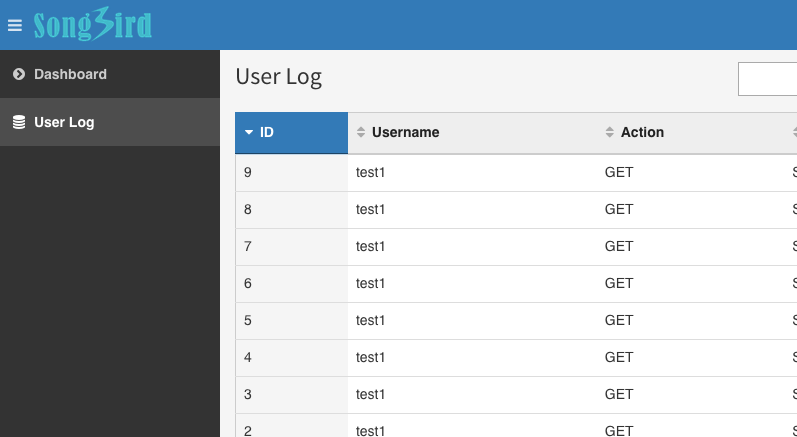

# Chapter 21: Dependency Injection Revisited

Upon reflection of what we have covered in the last 20 chapters, I think there are a lot of improvements that can be done. In particular, I feel that I wouldn't do justice to this book if I don't give an example of [Compiler Pass](http://symfony.com/doc/current/service_container/compiler_passes.html).

This is an advance chapter. If you skipped all the chapters and came to this chapter by chance, I recommend you to read up DI and DIC before continuing.

In this chapter, I like to introduce 2 improvements to the CMS using DI.

a) Simplifying config.yml

b) Adding Simple User Access Control to EasyAdminBundle.

## Simplifying config.yml

Due to DI, the bundle Extension is called when the bundle is being initialised. The end result is a bunch of parameters and services that can be used and referenced throughout the application.

The app/config/config.yml is read by all bundle extensions so that relevant information relating to the bundle can be extracted. So far, there are many configuration parameters like fos, vich, doctrine ...etc. To make the installation easier, we could move all these extra configuration to elsewhere so that developers don't have to worry about them when installing the CMS and it also makes the file looks cleaner.

The trick that does that is to implement the [PrependExtensionInterface](http://symfony.com/doc/current/bundles/prepend_extension.html).

```
# src/AppBundle/DependencyInjection/AppExtension.php

namespace AppBundle\DependencyInjection;

use Symfony\Component\DependencyInjection\ContainerBuilder;
use Symfony\Component\Config\FileLocator;
use Symfony\Component\DependencyInjection\Extension\PrependExtensionInterface;
use Symfony\Component\HttpKernel\DependencyInjection\Extension;
use Symfony\Component\DependencyInjection\Loader\YamlFileLoader;

/**
* This is the class that loads and manages your bundle configuration
*
* To learn more see {@link http://symfony.com/doc/current/cookbook/bundles/extension.html}
*/
class AppExtension extends Extension implements PrependExtensionInterface
{
    /**
     * {@inheritdoc}
     */
    public function load(array $configs, ContainerBuilder $container)
    {
        $configuration = new Configuration();
        $config = $this->processConfiguration($configuration, $configs);

        $loader = new YamlFileLoader($container, new FileLocator(__DIR__ . '/../Resources/config'));
        $loader->load('services.yml');
    }

    /**
     * http://symfony.com/doc/current/bundles/prepend_extension.html
     */
	public function prepend(ContainerBuilder $container)
	{
		// doctrine config
		$doctrine = [];
		$doctrine['orm']['resolve_target_entities']['Bpeh\NestablePageBundle\Model\PageBase'] = 'AppBundle\Entity\Page';
		$doctrine['orm']['resolve_target_entities']['Bpeh\NestablePageBundle\Model\PageMetaBase'] = 'AppBundle\Entity\PageMeta';
		$container->prependExtensionConfig('doctrine', $doctrine);

		// fos config
		$fosuser = [];
		$fosuser['db_driver'] = 'orm';
		$fosuser['firewall_name'] = 'main';
		$fosuser['user_class'] = 'AppBundle\Entity\User';
		$container->prependExtensionConfig('fos_user', $fosuser);

		# Nestable page config
		$page = [];
		$page['page_entity'] = 'AppBundle\Entity\Page';
		$page['pagemeta_entity'] = 'AppBundle\Entity\PageMeta';
		$page['page_form_type'] = 'AppBundle\Form\PageType';
		$page['pagemeta_form_type'] = 'AppBundle\Form\PageMetaType';
		$container->prependExtensionConfig('bpeh_nestable_page', $page);

		# Vich config
		$vich = [];
		$vich['db_driver'] = 'orm';
		$vich['mappings']['profile_images']['uri_prefix'] = '%app.profile_image.path%';
		$vich['mappings']['profile_images']['upload_destination'] = '%kernel.root_dir%/../web/uploads/profiles';
		$vich['mappings']['profile_images']['namer'] = 'vich_uploader.namer_uniqid';
		$vich['mappings']['featured_image']['uri_prefix'] = '%app.featured_image.path%';
		$vich['mappings']['featured_image']['upload_destination'] = '%kernel.root_dir%/../web/uploads/featured_images';
		$vich['mappings']['featured_image']['namer'] = 'vich_uploader.namer_uniqid';
		$container->prependExtensionConfig('vich_uploader', $vich);

	}
}
```

my config.yml then becomes like this

```
# app/config/config.yml

imports:
    - { resource: parameters.yml }
    - { resource: security.yml }
    - { resource: services.yml }
    - {resource: easyadmin/ }

parameters:
    locale: en
    supported_lang: [ 'en', 'fr']
    admin_path: admin
    app.profile_image.path: /uploads/profiles
    app.featured_image.path: /uploads/featured_images

framework:
    #esi:             ~
    translator:      { fallbacks: ["%locale%"] }
    secret:          "%secret%"
    router:
        resource: "%kernel.root_dir%/config/routing.yml"
        strict_requirements: ~
    form:            ~
    csrf_protection: ~
    validation:      { enable_annotations: true }
    #serializer:      { enable_annotations: true }
    templating:
        engines: ['twig']
    default_locale:  "%locale%"
    trusted_hosts:   ~
    trusted_proxies: ~
    session:
        # handler_id set to null will use default session handler from php.ini
        handler_id:  ~
    fragments:       ~
    http_method_override: true

# Twig Configuration
twig:
    debug:            "%kernel.debug%"
    strict_variables: "%kernel.debug%"
    globals:
        supported_lang: '%supported_lang%'

# Doctrine Configuration
doctrine:
    dbal:
        driver:   pdo_mysql
        host:     "%database_host%"
        port:     "%database_port%"
        dbname:   "%database_name%"
        user:     "%database_user%"
        password: "%database_password%"
        charset:  UTF8
    orm:
        auto_generate_proxy_classes: "%kernel.debug%"
        naming_strategy: doctrine.orm.naming_strategy.underscore
        auto_mapping: true

# Swiftmailer Configuration
swiftmailer:
    transport: "%mailer_transport%"
    host:      "%mailer_host%"
    username:  "%mailer_user%"
    password:  "%mailer_password%"
    spool:     { type: memory }
```

I could have moved more parameters over to the prepend function if I want.

## Adding Simple Access Control to EasyAdminBundle

I still want to congratulate [javiereguiluz](https://github.com/javiereguiluz) for creating the wonderful [EasyAdminBundle](https://github.com/javiereguiluz/EasyAdminBundle). As of current, the bundle doesn't support user permissions out of the box. I believe there might be plans to include this feature in the future as it is a widely requested feature.

As an exercise, let's say that we want to customise the bundle such that we can control access to certain parts of the admin area based on the user's role. We want to do that simply by changing the easyadmin yaml files.

Let us allow all authenticated users to access the admin area rather than just ROLE_USER.

```
# app/config/security.yml
...
  access_control:
      - { path: ^/login$, role: IS_AUTHENTICATED_ANONYMOUSLY }
      - { path: ^/resetting, role: IS_AUTHENTICATED_ANONYMOUSLY }
      - { path: ^/%admin_path%/, role: IS_AUTHENTICATED_FULLY }
```

The new design.yml should look like this:

```
# app/config/easyadmin/design.yml

easy_admin:
    design:
        brand_color: '#337ab7'
        assets:
            css:
              - /bundles/app/css/style.css
        menu:
          - { label: 'Dashboard', route: 'dashboard', default: true }
          - { entity: 'User', icon: 'user', role: ROLE_ADMIN }
          - { entity: 'Page', icon: 'file', role: ROLE_USER }
          - { entity: 'UserLog', icon: 'database', role: ROLE_ADMIN }
```

Noticed that we have added a new array key called "role" to each menu item and the value (say "ROLE_ADMIN") means the mimimum permission level required to access that menu. In this case, everyone can see the dashboard, ROLE_USER and above can see the Page link and only ROLE_ADMIN can see the User and UserLog link.

We are going to do something similar for all the entities yaml, starting from the page entity

```
# app/config/easyadmin/page.yml

easy_admin:
    entities:
        Page:
            class: AppBundle\Entity\Page
            label: admin.link.page_management
            role: ROLE_USER
            # for new page
            new:
                fields:
                  - slug
                  - isPublished
                  - sequence
                  - parent
            edit:
                fields:
                  - slug
                  - isPublished
                  - sequence
                  - parent
                  - pageMetas
            show:
                fields:
                  - id
                  - slug
                  - isPublished
                  - sequence
                  - parent
                  - modified
                  - created
                  - pageMetas
            list:
                actions: ['show', 'edit', 'delete']
                fields:
                  - id
                  - slug
                  - isPublished
                  - sequence
                  - parent
                  - modified
            delete:
                role: ROLE_ADMIN
        PageMeta:
            class: AppBundle\Entity\PageMeta
            role: ROLE_USER
            form:
              fields:
                - page_title
                - menu_title
                - { property: 'locale', type: 'AppBundle\Form\LocaleType' }
                - { type: 'divider' }
                - { property: 'featuredImageFile', type: 'vich_image' }
                - { property: 'short_description', type: 'ckeditor' }
                - { property: 'content', type: 'ckeditor' }
                - page
```

We are allowing ROLE_USER to access all the actions of the page entity except deleting.

Now, the user entity:

```
# app/config/easyadmin/user.yml

easy_admin:
    entities:
        User:
            class: AppBundle\Entity\User
            label: admin.link.user_management
            role: ROLE_ADMIN
            ...

```

and finally - userlog.yml. 

```
# app/config/easyadmin/userlog.yml

easy_admin:
    entities:
        UserLog:
            class: AppBundle\Entity\UserLog
            label: admin.link.user_log
            role: ROLE_ADMIN
            show:
                actions: ['list', '-edit', '-delete']
            list:
                actions: ['show', '-edit', '-delete']
```

When parameters and services are created by the extension but not yet compiled in optimised DIC, there is a chance to manipulate them. Compiler Pass exists for this purpose.

Let us tell our AppBundle to initiate its compiler pass when it is loaded by the kernel.

```
# src/AppBundle/AppBundle.php

<?php

namespace AppBundle;

use Symfony\Component\HttpKernel\Bundle\Bundle;
use Symfony\Component\DependencyInjection\ContainerBuilder;
use AppBundle\DependencyInjection\Compiler\ConfigPass;

class AppBundle extends Bundle
{
	public function build(ContainerBuilder $container)
	{
		parent::build($container);
		$container->addCompilerPass(new ConfigPass());
	}
}

```

We have added a new compiler pass class called ConfigPass.php. Compiler Pass needs to extend the CompilerPassInterface.


```
# src/AppBundle/DependencyInjection/Compiler/ConfigPass.php

<?php

namespace AppBundle\DependencyInjection\Compiler;

use Symfony\Component\DependencyInjection\Compiler\CompilerPassInterface;
use Symfony\Component\DependencyInjection\ContainerBuilder;

class ConfigPass implements CompilerPassInterface
{
	public function process( ContainerBuilder $container ) {

		// $container->getParameterBag();
		// $container->getServiceIds();

		$config = $container->getParameter('easyadmin.config');

		// use menu to use IS_AUTHENTICATED_FULLY role by default if not set
		foreach($config['design']['menu'] as $k => $v) {
			if (!isset($v['role'])) {
				$config['design']['menu'][$k]['role'] = 'IS_AUTHENTICATED_FULLY';
			}
		}

		// update entities to use IS_AUTHENTICATED_FULLY role by default if not set
		foreach ($config['entities'] as $k => $v) {
			if (!isset($v['role'])) {
				$config['entities'][$k]['role'] = 'IS_AUTHENTICATED_FULLY';
			}
		}

		// update views to use entities role by default if not set
		foreach ($config['entities'] as $k => $v) {
			$views = ['new', 'edit', 'show', 'list'];
			foreach ($views as $view) {
				if (!isset($v[$view]['role'])) {
					$config['entities'][$k][$view]['role'] = $v['role'];
				}
			}
		}

		$container->setParameter('easyadmin.config', $config);

	}

}
```

What we have done here is to change the easyadmin.config parameter produced by the EasyAdminBundle. easyadmin.config is simply a bunch of arrays built based on the yaml config under app/config/easy_admin. Each for-loop adds a new key called "role" with the default "IS_AUTHENTICATED_FULLY" role if not specified by the config.

EasyAdmin dispatches lots of events. We were already subscribed to it.

```
# src/AppBundle/Resources/config/services.yml
  ...
  app.subscriber:
    class: AppBundle\EventListener\AppSubscriber
    arguments:
        - "@service_container"
    tags:
        - { name: kernel.event_subscriber }
```

We now need to add a bit more logic to the subscriber.

```
# src/AppBundle/EventListener/AppSubscriber.php

class AppSubscriber implements EventSubscriberInterface
{
    protected $container;

    /**
     * AppSubscriber constructor.
     * @param ContainerInterface $container
     */
    public function __construct(ContainerInterface $container) // this is @service_container
    {
        $this->container = $container;
    }

    /**
     * @return array
     */
    public static function getSubscribedEvents()
    {
    	// return the subscribed events, their methods and priorities
        return array(
		EasyAdminEvents::PRE_NEW => 'checkUserRights',
                EasyAdminEvents::PRE_LIST => 'checkUserRights',
                EasyAdminEvents::PRE_EDIT => 'checkUserRights',
                EasyAdminEvents::PRE_SHOW => 'checkUserRights',
        	EasyAdminEvents::PRE_DELETE => 'checkUserRights',
                ...
                );
    }

    /**
     * show an error if user is not superadmin and tries to manage restricted stuff
     *
     * @param GenericEvent $event event
     * @return null
     * @throws AccessDeniedException
     */
    public function checkUserRights(GenericEvent $event)
        {

            // if super admin, allow all
    	    $authorization = $this->container->get('security.authorization_checker');
            $request = $this->container->get('request_stack')->getCurrentRequest()->query;
            if ($authorization->isGranted('ROLE_SUPER_ADMIN')) {
                return;
            }

            $entity = $request->get('entity');
            $action = $request->get('action');
            $user_id = $request->get('id');

            // This is an exception, allow user to view and edit their own profile irregardless of permissions
            if ($entity == 'User') {
                // if edit and show
                if ($action == 'edit' || $action == 'show') {
                    // check user is himself
                    if ($user_id == $this->container->get('security.token_storage')->getToken()->getUser()->getId()) {
                        return;
                    }
                }
            }

    	    $config = $this->container->get('easyadmin.config.manager')->getBackendConfig();
            // check for permission for each action
    	    foreach ($config['entities'] as $k => $v) {
    	    	if ($entity == $k && !$authorization->isGranted($v[$action]['role'])) {
    			    throw new AccessDeniedException();
    		    }
    	    }
        }
    ...
```

We have triggered the checkUserRights function based on a few EasyAdmin events. We have allowed the logged in user to edit his own profile irregardless of role's permission. Then, the for-loop does the magic of allowing or denying user to access different parts of the admin area based on the role key in easyadmin.config.manager service.

Note that this will work only if our AdminController dispatches the events, ie

```
# src/AppBundle/Controller/AdminController.php

...
	/**
	 * Show Page List page
	 * @return \Symfony\Component\HttpFoundation\Response
	 */
    public function listPageAction()
    {
	    $this->dispatch(EasyAdminEvents::PRE_LIST);
	    ...

    }
```

The menu display is not managed by the event subscriber. We simply need to change the twig a bit.

```
# app/Resources/views/easy_admin/menu.html.twig





    
        
        <li class="{{ item.type == 'divider' ? 'header' }} {{ item.children is not empty ? 'treeview' }} {{ app.request.query.get('menuIndex')|default(-1) == loop.index0 ? 'active' }} {{ app.request.query.get('submenuIndex')|default(-1) != -1 ? 'submenu-active' }}">
            {{ helper.render_menu_item(item) }}

            
                <ul class="treeview-menu">
                    
                        <li class="{{ subitem.type == 'divider' ? 'header' }} {{ app.request.query.get('menuIndex')|default(-1) == loop.parent.loop.index0 and app.request.query.get('submenuIndex')|default(-1) == loop.index0 ? 'active' }}">
                            {{ helper.render_menu_item(subitem) }}
                        </li>
                    
                </ul>
            
        </li>
        
    


```

Try logging in now as test1 and you will see that the menu and entities should be access controlled.



Note that the above method for allowing user permissions for EasyAdmin is just one of many ways to do it. Implementing a full solution needs a big code rewrite. One big area I can think of is to allow roles to define its actions. ie something like this:

```
easy_admin:
    entities:
        UserLog:
            class: AppBundle\Entity\UserLog
            label: admin.link.user_log
            role: ROLE_ADMIN
                show:
                    actions: ['list', 'edit', 'delete']
                list:
                    actions: ['show', '-edit', '-delete']
            role: ROLE_USER
                show:
                    actions: ['list', '-edit', '-delete']
                list:
                    actions: ['show', '-edit', '-delete']        
```

But this structure would require a lot of code change to the templates. We have enough to think about and will leave it for now.

## Update BDD (Optional)

Normal users can now see the Page list in the dashboard, perform all actions except delete. Add this rule to the new BDD Test.

Write your test and make sure everything passes.

## Summary

In this chapter, we have cleaned up config.yml and provided a custom solution to make EasyAdmin support user permissions in the admin area. It was a huge effort but not yet a full solution. However, it should make life easy for people who wants to configure admin permissions easily.

## Exercises

* Other than menu.html.twig, try updating other EasyAdmin view templates to support the "role" attribute. Is there a simple way to do it?

## References

* [Prepend Config](http://symfony.com/doc/current/bundles/prepend_extension.html)
* [Dependency Injection Component](https://symfony.com/doc/current/components/dependency_injection.html)
* [Service Container](http://symfony.com/doc/current/service_container.html)
* [Tagging Symfony Services](http://thorpesystems.com/blog/tagging-symfony-services/)
