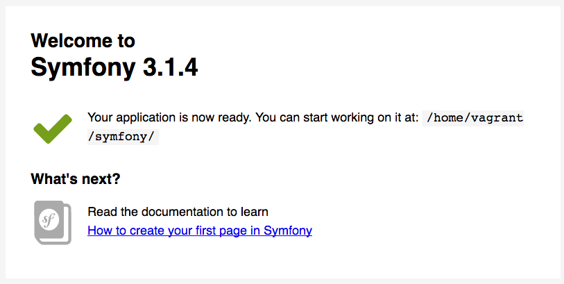

# Chapter 3: Creating the Dev Environment

So that we speak the same language throughout the book, we need a dev (development) environment that it is consistent in everyone's host. We will use [docker](https://www.docker.com/) for this purpose.

The idea is to do **actual coding in your host** (main operating system) and let docker other services like the web server, MYSQL ... etc. Note that 99% of the time, you don't need to touch the docker instances except to make sure that they are all up and running.

## Installation

* Fork songbird from [github](https://github.com/bernardpeh/songbird)

* Clone it

```
-> cd ~
-> git clone git@github.com:your_username/songbird.git
-> cd songbird
-> git checkout chapter_3
```

* Get the [symfony](http://symfony.com/doc/current/setup.html) command line

* Install [docker](https://docs.docker.com/engine/installation/)

* Install [Docker-compose](https://docs.docker.com/compose/install/)

* We can now fire up docker containers

```
# update SYMFONY_APP_PATH parameters in the .env file and leave the rest as defaults
-> cp .env.dist .env

# we need to create new dir when mounting docker (if case if using nfs)
-> mkdir -p .data/db
-> mkdir -p logs/{symfony,nginx}

# update parameters in the .env file if you want, then run
-> docker-compose up --build -d

# to confirm all the containers are fired up correctly
-> docker-compose ps
      Name                    Command              State               Ports             
----------------------------------------------------------------------------------------
songbird_db_1      docker-entrypoint.sh mysqld     Up      0.0.0.0:8006->3306/tcp                      
songbird_nginx_1   nginx                           Up      443/tcp, 0.0.0.0:8000->80/tcp 
songbird_php_1     docker-php-entrypoint php-fpm   Up      0.0.0.0:9000->9000/tcp
...
```

* Add songbird.app to your host file.
```
# for unix systems
-> sudo echo "127.0.0.1 songbird.app" >> /etc/hosts
```

* We have mapped port 8000 to our nginx web server, open up browser and go to http://songbird.app:8000. If you see an installation successful page, you are on the right track.



* Let us configure the dev url to allow connection from the parent host

```
# in symfony/web/app_dev.php

// comment off this ip restriction

// if (isset($_SERVER['HTTP_CLIENT_IP'])
//     || isset($_SERVER['HTTP_X_FORWARDED_FOR'])
//     || !(in_array(@$_SERVER['REMOTE_ADDR'], ['127.0.0.1', '::1']) || php_sapi_name() === 'cli-server')
// ) {
//     header('HTTP/1.0 403 Forbidden');
//     exit('You are not allowed to access this file. Check '.basename(__FILE__).' for more information.');
// }
```
* Now try this url http://songbird.app:8000/app_dev.php and you should see the same successful page but with a little icon/toolbar at the bottom of the page. That's right, you are now in dev mode. Why the "app_dev.php"? That is like the default page for the dev environment, something unique to Symfony which we will always be using during development.

* To check that everything is working, let us look at the logs

```
-> tail -f logs/{nginx/*,symfony/*}

==> logs/nginx/error.log <==

==> logs/nginx/symfony_access.log <==
172.18.0.1 - - [19/Jan/2017:00:59:00 +0000] "GET / HTTP/1.1" 200 1947 "-" "Mozilla/5.0 (Macintosh; Intel Mac OS X 10_11_6) AppleWebKit/537.36 (KHTML, like Gecko) Chrome/55.0.2883.95 Safari/537.36"
172.18.0.1 - - [19/Jan/2017:00:59:00 +0000] "GET /favicon.ico HTTP/1.1" 200 6518 "http://songbird.app:8000/" "Mozilla/5.0 (Macintosh; Intel Mac OS X 10_11_6) AppleWebKit/537.36 (KHTML, like Gecko) Chrome/55.0.2883.95 Safari/537.36"
172.18.0.1 - - [19/Jan/2017:01:03:18 +0000] "GET /app_dev.php HTTP/1.1" 403 101 "-" "Mozilla/5.0 (Macintosh; Intel Mac OS X 10_11_6) AppleWebKit/537.36 (KHTML, like Gecko) Chrome/55.0.2883.95 Safari/537.36"
172.18.0.1 - - [19/Jan/2017:01:04:20 +0000] "GET /app_dev.php HTTP/1.1" 403 101 "-" "Mozilla/5.0 (Macintosh; Intel Mac OS X 10_11_6) AppleWebKit/537.36 (KHTML, like Gecko) Chrome/55.0.2883.95 Safari/537.36"
172.18.0.1 - - [19/Jan/2017:01:12:02 +0000] "GET /app_dev.php HTTP/1.1" 200 8132 "-" "Mozilla/5.0 (Macintosh; Intel Mac OS X 10_11_6) AppleWebKit/537.36 (KHTML, like Gecko) Chrome/55.0.2883.95 Safari/537.36"
172.18.0.1 - - [19/Jan/2017:01:12:14 +0000] "GET /app_dev.php/_wdt/2de5e5 HTTP/1.1" 200 6466 "http://songbird.app:8000/app_dev.php" "Mozilla/5.0 (Macintosh; Intel Mac OS X 10_11_6) AppleWebKit/537.36 (KHTML, like Gecko) Chrome/55.0.2883.95 Safari/537.36"
172.18.0.1 - - [19/Jan/2017:01:17:49 +0000] "GET /app_dev.php HTTP/1.1" 200 8133 "-" "Mozilla/5.0 (Macintosh; Intel Mac OS X 10_11_6) AppleWebKit/537.36 (KHTML, like Gecko) Chrome/55.0.2883.95 Safari/537.36"
172.18.0.1 - - [19/Jan/2017:01:17:49 +0000] "GET /favicon.ico HTTP/1.1" 200 6518 "http://songbird.app:8000/app_dev.php" "Mozilla/5.0 (Macintosh; Intel Mac OS X 10_11_6) AppleWebKit/537.36 (KHTML, like Gecko) Chrome/55.0.2883.95 Safari/537.36"
172.18.0.1 - - [19/Jan/2017:01:17:52 +0000] "GET /app_dev.php/_wdt/85ae68 HTTP/1.1" 200 6488 "http://songbird.app:8000/app_dev.php" "Mozilla/5.0 (Macintosh; Intel Mac OS X 10_11_6) AppleWebKit/537.36 (KHTML, like Gecko) Chrome/55.0.2883.95 Safari/537.36"

==> logs/nginx/symfony_error.log <==

==> logs/symfony/dev.log <==
[2017-01-19 01:17:45] request.INFO: Matched route "homepage". {"route":"homepage","route_parameters":{"_controller":"AppBundle\\Controller\\DefaultController::indexAction","_route":"homepage"},"request_uri":"http://songbird.app:8000/app_dev.php/","method":"GET"} []
[2017-01-19 01:17:46] security.INFO: Populated the TokenStorage with an anonymous Token. [] []
[2017-01-19 01:17:51] request.INFO: Matched route "_wdt". {"route":"_wdt","route_parameters":{"_controller":"web_profiler.controller.profiler:toolbarAction","token":"85ae68","_route":"_wdt"},"request_uri":"http://songbird.app:8000/app_dev.php/_wdt/85ae68","method":"GET"} []
```

Good, nginx and symfony is logging stuff.

***Every time your machine restarts, remember to start docker, then run `docker-compose up -d` in the songbird folder to start the dev environment.***

Finally, let us ignore .env in .gitignore

```
# .gitignore

/.vagrant/
.idea/
logs/
...
/.env
```

## Mac Users (Optional)

Docker is such an amazing tool and I think it will only get more popular. However at the time of writing, mac operating system suffer performance issues due to osxfs. We can improve the disk access speed by using nfs instead. You can google about this and read about the technical details.

To mount via nfs, click on the docker icon on the top of your desktop -> Preferences -> File Sharing (remove all mounted dirs except /tmp) -> Restart docker.

We can then export the whole /Users dir

```
-> cd ~
-> git clone https://github.com/IFSight/d4m-nfs
-> cd d4m-nfs
-> echo "/Users:/Users" > etc/d4m-nfs-mounts.txt
-> sudo ./d4m-nfs.sh
# restart docker containers
-> cd ~/songbird
-> docker-compose down
-> docker-compose up -d
```

## Summary

In this chapter, we setup the development environment using docker. We have installed Symfony and configured the host to access SongBird from the host machine.

**Note: Docker can be slow on mac. Using SSD Helps**

Remember to commit all your changes before moving on.

## Exercises (Optional)

* Try running Symfony's build-in webserver. What command would you use? What are the pros and cons of using the build-in webserver?

* Delete the symfony dir. Reinstall Symfony following the [Symfony Installation](https://symfony.com/doc/current/book/installation.html) instructions.
 
* How many ways are there to install Symfony? What are the pros and cons of each?

## References

* [Docker Compose](https://docs.docker.com/compose/)

