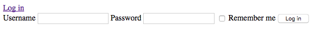
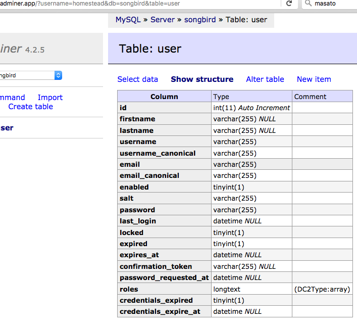

# Chapter 6: The User Management System Part 1

User Management System is a core part of any CMS. We will create this component using the popular [FOSUserBundle](https://github.com/FriendsOfSymfony/FOSUserBundle).

## Pre-setup

Make sure we are in the right branch. Let us branch off from the previous chapter.

```
-> git checkout -b my_chapter6
```

## Installing the FOSUserBundle

Add the bundle in composer.json

```
-> composer require friendsofsymfony/user-bundle ~2.0@dev
```

Note that you can also install the bundle by editing composer.json directly and then

```
-> composer update

```

Now in AppKernel, we need to register the bundles

```
# app/AppKernel.php
...
public function registerBundles()
{
    $bundles = array(
        ...
        new AppBundle\AppBundle(),
        // init my fosuser
        new FOS\UserBundle\FOSUserBundle(),
        new AppBundle\User()
    );
}
```

AppBundle\User() will look for the User class in User.php (under the AppBundle namespace). We want the User class to inherit all properties of FOSUserBundle.

```
# src/AppBundle/User.php

namespace AppBundle;

use Symfony\Component\HttpKernel\Bundle\Bundle;

class User extends Bundle
{
    // use a child bundle
    public function getParent()
    {
	return 'FOSUserBundle';
    }
}
```

Next we need to configure FOSUserBundle. Don't worry if certain directives doesn't make sense. It will as you progress further. Note that yaml files cannot contain tabs.

```
# app/config/config.yml
...
# turn on translator
translator:      { fallbacks: ["%locale%"] }
...

framework:
    ...
    session:
        # http://symfony.com/doc/current/reference/configuration/framework.html#handler-id
        # we have to use the system session storage because the default doesn't work with vagrant.
        handler_id:  ~
        # save_path:   "%kernel.root_dir%/../var/sessions/%kernel.environment%"
        
# fosuser config
fos_user:
    db_driver: orm
    firewall_name: main
    user_class: AppBundle\Entity\User
```

and setup the security and firewall, your file should look like this

```
# app/config/security.yml
security:
  encoders:
          FOS\UserBundle\Model\UserInterface: bcrypt

  # http://symfony.com/doc/current/book/security.html#where-do-users-come-from-user-providers
  providers:
      fos_userbundle:
          id: fos_user.user_provider.username

  role_hierarchy:
          ROLE_ADMIN:       ROLE_USER
          ROLE_SUPER_ADMIN: ROLE_ADMIN

  firewalls:
      # disables authentication for assets and the profiler, adapt it according to your needs
      dev:
          pattern: ^/(_(profiler|wdt)|css|images|js)/
          security: false

      main:
          pattern: ^/
          form_login:
              provider: fos_userbundle
              csrf_token_generator: security.csrf.token_manager
          logout:       true
          anonymous:    true

  access_control:
          - { path: ^/login$, role: IS_AUTHENTICATED_ANONYMOUSLY }
          - { path: ^/register, role: IS_AUTHENTICATED_ANONYMOUSLY }
          - { path: ^/resetting, role: IS_AUTHENTICATED_ANONYMOUSLY }
          - { path: ^/admin/, role: ROLE_ADMIN }
```

## Creating the User Entity

Have a quick read if you are unfamiliar with [doctrine and entity](http://symfony.com/doc/current/book/doctrine.html). We will be talking about doctrine very often in this book.

Symfony allows us to automate lots of things using command line, including the creation of entities. We will create the user entity with 2 custom fields called firstname and lastname.

```
-> app/console generate:doctrine:entity

# You will be prompted a series of questions.

The Entity shortcut name: AppBundle:User

Configuration format (yml, xml, php, or annotation) [annotation]: annotation

New field name (press <return> to stop adding fields): firstname
Field type [string]:
Field length [255]:
Is nullable [false]: true
Unique [false]:

New field name (press <return> to stop adding fields): lastname
Field type [string]:
Field length [255]:
Is nullable [false]: true
Unique [false]:
```

Once you are familiar with the command line, you should be able to generate the entity and other files without prompts and we will be doing that in the future chapters.

[FOSUserBundle Groups](https://github.com/FriendsOfSymfony/FOSUserBundle/blob/master/Resources/doc/groups.md) are useful when you want to group users together. For the sake of simplicity, we won't be using this feature. However, you should be able to add this feature in easily once you are comfortable with the Symfony workflow.

Now, the entity class is generated under src/AppBundle/Entity folder. We need to extend the fosuserbundle and make the id protected because of inheritance. If you open up the file, you will see that the code has been created for you already.

```
namespace AppBundle\Entity;

use FOS\UserBundle\Model\User as BaseUser;
use Doctrine\ORM\Mapping as ORM;

/**
 * User
 *
 * @ORM\Table(name="user")
 * @ORM\Entity(repositoryClass="AppBundle\Repository\UserRepository")
 */
class User extends BaseUser
{
    /**
     * @var int
     *
     * @ORM\Column(name="id", type="integer")
     * @ORM\Id
     * @ORM\GeneratedValue(strategy="AUTO")
     */
    protected $id;

    /**
     * @var string
     *
     * @ORM\Column(name="firstname", type="string", length=255, nullable=true)
     */
    private $firstname;

    /**
     * @var string
     *
     * @ORM\Column(name="lastname", type="string", length=255, nullable=true)
     */
    private $lastname;

    /**
     * User constructor.
     */
    public function __construct()
    {
        parent::__construct();
    }

    /**
     * Get id
     *
     * @return int
     */
    public function getId()
    {
        return $this->id;
    }

    /**
     * Set firstname
     *
     * @param string $firstname
     *
     * @return User
     */
    public function setFirstname($firstname)
    {
        $this->firstname = $firstname;

        return $this;
    }

    /**
     * Get firstname
     *
     * @return string
     */
    public function getFirstname()
    {
        return $this->firstname;
    }

    /**
     * Set lastname
     *
     * @param string $lastname
     *
     * @return User
     */
    public function setLastname($lastname)
    {
        $this->lastname = $lastname;

        return $this;
    }

    /**
     * Get lastname
     *
     * @return string
     */
    public function getLastname()
    {
        return $this->lastname;
    }
}
```

You will noticed all the getters and setters have already been generated for you as well. Cool!

Now, we need to configure the routes. The default routes provided by FOSUser is a good start.

```
# app/config/routing.yml
...
# FOS user bundle default routing
fos_user_security:
    resource: "@FOSUserBundle/Resources/config/routing/security.xml"

fos_user_profile:
    resource: "@FOSUserBundle/Resources/config/routing/profile.xml"
    prefix: /profile

fos_user_resetting:
    resource: "@FOSUserBundle/Resources/config/routing/resetting.xml"
    prefix: /resetting

fos_user_change_password:
    resource: "@FOSUserBundle/Resources/config/routing/change_password.xml"
    prefix: /profile
```

To check that the new routes have been installed correctly,

```
-> app/console debug:router | grep fos

 fos_user_security_login           GET|POST ANY    ANY  /login
 fos_user_security_check           POST     ANY    ANY  /login_check
 fos_user_security_logout          GET      ANY    ANY  /logout
 fos_user_profile_show             GET      ANY    ANY  /profile/
 fos_user_profile_edit             GET|POST ANY    ANY  /profile/edit
 fos_user_resetting_request        GET      ANY    ANY  /resetting/request
 fos_user_resetting_send_email     POST     ANY    ANY  /resetting/send-email
 fos_user_resetting_check_email    GET      ANY    ANY  /resetting/check-email
 fos_user_resetting_reset          GET|POST ANY    ANY  /resetting/reset/{token}
 fos_user_change_password          GET|POST ANY    ANY  /profile/change-password

```

or we can use the router:match command to match the exact url and get more details

```
-> app/console router:match /profile/
Route "fos_user_profile_show" matches

[router] Route "fos_user_profile_show"
Name         fos_user_profile_show
Path         /profile/
Path Regex   #^/profile/$#s
Host         ANY
Host Regex
Scheme       ANY
Method       GET
Class        Symfony\Component\Routing\Route
Defaults     _controller: FOSUserBundle:Profile:show
Requirements NO CUSTOM
Options      compiler_class: Symfony\Component\Routing\RouteCompiler
```

See how much work has done for you by inheriting the FOSUserBundle... This step allows you to use many default FOSUserBundle functionalities like password reset and user profile update without writing a single line of code! Now, let us test one of the routes by going to

```
http://songbird.app/app_dev.php/login
```



You should see a simple login page.

To verify that the schema is correct, let us generate it:

```
-> app/console doctrine:schema:create
```

Login to http://adminer.app/ with username: homestead, password: secret and click on the songbird db. You should see there are 0 rows for the user and click on the user schema. You should see your firstname and lastname fields in additional to all the default FOSUserBundle fields.



We are gearing up. Ready for more?

## Summary

In this chapter, we have installed FOSUserBundle and extended it in AppBundle. We have verified that the installation was correct by looking at the default login page and database schema.

Remember to commit all your changes before moving on.

## Exercises (Optional)

* Try installing the UserBundle outside of Appbundle. Are there any pros and cons of doing that as compared to putting all the bundles in AppBundle?

## References

* [FOSUserBundle Doc](https://github.com/FriendsOfSymfony/FOSUserBundle/blob/master/Resources/doc/index.md)

* [FOSUserBundle Installation](https://symfony.com/doc/master/bundles/FOSUserBundle/index.html)

* [Routing](http://symfony.com/doc/current/book/routing.html)