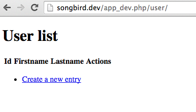
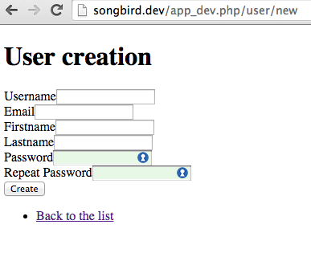
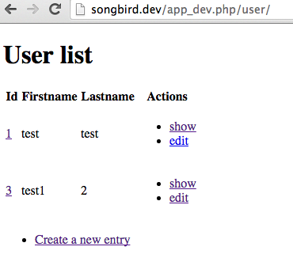
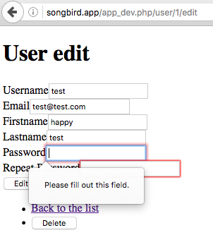

# Chapter 7: The User Management System Part 2

We have installed the FOSUserBundle but it looks like there are still big chunks of functionalities missing. How do we (C)reate, (R)ead, (U)pdate and (D)elete a user or group for example?

You see the word "CRUD" appearing so many times because it is part of RAD. All frameworks today come with auto CRUD generation.

## Automated User CRUD Generation

We will generate CRUD for the UserBundle.

```
-> scripts/console doctrine:generate:crud

The Entity shortcut name: AppBundle:User

By default, the generator creates two actions: list and show.
You can also ask it to generate "write" actions: new, update, and delete.

Do you want to generate the "write" actions [no]? yes

Determine the format to use for the generated CRUD.

Configuration format (yml, xml, php, or annotation) [annotation]: annotation

Determine the routes prefix (all the routes will be "mounted" under this
prefix: /prefix/, /prefix/new, ...).

Routes prefix [/user]:


  Summary before generation


You are going to generate a CRUD controller for "AppBundle:User"
using the "annotation" format.

Do you confirm generation [yes]?


  CRUD generation


Generating the CRUD code: OK
```

Now go to

```
http://songbird.app:8000/app_dev.php/user/
```



We haven't added any data yet. The database should be empty as per the previous chapter.

Let us add some data. Click on "Create a new entry" or go to

```
http://songbird.app:8000/app_dev.php/user/new
```

and enter a dummy firstname and lastname, then click create.

You should see a "Integrity constraint violation: 1048 Column 'username' cannot be null" error. Why?

I am going to skip through all technicalities for now and tell you where the answer is. Look at

```
# vendor/friendsofsymfony/user-bundle/Resources/config/validation.xml
...
<property name="username">
    <constraint name="NotBlank">
        <option name="message">fos_user.username.blank</option>
        <option name="groups">
            <value>Registration</value>
            <value>Profile</value>
        </option>
        ...
```

It is possible to create a new user from command line, the code is at:

```
# vendor/friendsofsymfony/user-bundle/Command/CreateUserCommand.php
...
class CreateUserCommand extends ContainerAwareCommand
{
    /**
     * @see Command
     */
    protected function configure()
    {
        $this
            ->setName('fos:user:create')
            ->setDescription('Create a user.')
            ->setDefinition(array(
                new InputArgument('username', InputArgument::REQUIRED, 'The username'),
                new InputArgument('email', InputArgument::REQUIRED, 'The email'),
                new InputArgument('password', InputArgument::REQUIRED, 'The password'),
```

Did you remember that the "fos:user:create" command is available under the `scripts/console` command? You can infer from these lines that username, email and password are compulsory. How do we add these extra fields in the user form?

## Adding Fields to the User Form

The extra FOSUserBundle fields were not automatically added when we created the CRUD using the command line. The automated CRUD creation process cannot pick up inheritance yet (I hope one day it will). We have to create the fields manually.

```
# src/AppBundle/Form/UserType.php
namespace AppBundle\Form;

use Symfony\Component\Form\AbstractType;
use Symfony\Component\Form\FormBuilderInterface;
use Symfony\Component\OptionsResolver\OptionsResolver;
use Symfony\Component\Form\Extension\Core\Type\RepeatedType;
use Symfony\Component\Form\Extension\Core\Type\PasswordType;

class UserType extends AbstractType
{
    /**
     * @param FormBuilderInterface $builder
     * @param array $options
     */
    public function buildForm(FormBuilderInterface $builder, array $options)
    {
        $builder
            ->add('username')
            ->add('email')
            ->add('firstname')
            ->add('lastname')
            ->add('password', RepeatedType::class, array(
                'type' => PasswordType::class,
                'invalid_message' => 'The password fields must match.',
                'required' => true,
                'first_options'  => array('label' => 'Password'),
                'second_options' => array('label' => 'Repeat Password'),
            ))
        ;
    }
    ...
```

Refresh the browser and if changes are not showing up, we need to delete the cache.

```
-> bin/console cache:clear
```

This `cache:clear` command is equivalent to "rm -rf var/cache/dev". It is a useful alternative to clear:cache. If no environment is set, the environment is set to develop. To delete prod cache,

```
-> bin/console cache:clear -e prod
```

Let us create 2 test users, say "test" and "test1"



We can now list them by going to /user



Now verify that the new data is inserted into the user table by running some sql

```
-> scripts/mysql "select id,username,password from user"

+----+----------+----------+
| id | username | password |
+----+----------+----------+
|  1 | test     | test     |
|  2 | test1    | test1    |
+----+----------+----------+
```

**Wow**, why was the password exposed? shouldn't the password be encrypted automatically?

No, because the CRUD that we have created previously didn't know that the password was supposed to be encrypted before inserting into the db. Fortunately, FOSUserBundle has a service container that can help us with this. The word ***service*** is important in Symfony. Don't worry about it for now as we will cover this in the following chapters.

For the sake of curiousity, let us see all the FOSUserBundle service containers.

```
-> ./scripts/console debug:container | grep fos

 fos_user.change_password.form.factory                              FOSUserBundleFormFactoryFormFactory
 fos_user.change_password.form.type                                 FOSUserBundleFormTypeChangePasswordFormType
 fos_user.group.form.factory                                        FOSUserBundleFormFactoryFormFactory
 fos_user.group.form.type                                           FOSUserBundleFormTypeGroupFormType
 fos_user.group_manager                                             FOSUserBundleDoctrineGroupManager
 fos_user.listener.authentication                                   FOSUserBundleEventListenerAuthenticationListener
 fos_user.listener.flash                                            FOSUserBundleEventListenerFlashListener
 fos_user.listener.resetting                                        FOSUserBundleEventListenerResettingListener
 fos_user.mailer                                                    FOSUserBundleMailerMailer
 fos_user.profile.form.factory                                      FOSUserBundleFormFactoryFormFactory
 fos_user.profile.form.type                                         FOSUserBundleFormTypeProfileFormType
 fos_user.registration.form.factory                                 FOSUserBundleFormFactoryFormFactory
 fos_user.registration.form.type                                    FOSUserBundleFormTypeRegistrationFormType
 fos_user.resetting.form.factory                                    FOSUserBundleFormFactoryFormFactory
 fos_user.resetting.form.type                                       FOSUserBundleFormTypeResettingFormType
 fos_user.security.interactive_login_listener                       FOSUserBundleEventListenerLastLoginListener
 fos_user.security.login_manager                                    FOSUserBundleSecurityLoginManager
 fos_user.user_manager                                              FOSUserBundleDoctrineUserManager
 fos_user.username_form_type                                        FOSUserBundleFormTypeUsernameFormType
 fos_user.util.email_canonicalizer                                  FOSUserBundleUtilCanonicalizer
 fos_user.util.token_generator                                      FOSUserBundleUtilTokenGenerator
 fos_user.util.user_manipulator                                     FOSUserBundleUtilUserManipulator
```

The logic for all user related actions is stored in FOS\UserBundle\Doctrine\UserManager. The service for that class is fos_user.user_manager. Let us use the service in UserController.php

```
# src/AppBundle/Controller/UserController.php
...
    /**
     * Creates a new User entity.
     *
     * @Route("/new", name="user_new")
     * @Method({"GET", "POST"})
     */
    public function newAction(Request $request)
    {
        $user = new User();
        $form = $this->createForm('AppBundle\Form\UserType', $user);
        $form->handleRequest($request);

        if ($form->isSubmitted() && $form->isValid()) {
            // CHANGE HERE
            $userManager = $this->get('fos_user.user_manager');
            $user->setPlainPassword($user->getPassword());
            $userManager->updateUser($user);
            // $em = $this->getDoctrine()->getManager();
            // $em->persist($user);
            // $em->flush();

            return $this->redirectToRoute('user_show', array('id' => $user->getId()));
        }

        return $this->render('user/new.html.twig', array(
            'user' => $user,
            'form' => $form->createView(),
        ));
    }
...
    /**
     * Displays a form to edit an existing User entity.
     *
     * @Route("/{id}/edit", name="user_edit")
     * @Method({"GET", "POST"})
     */
    public function editAction(Request $request, User $user)
    {
        $deleteForm = $this->createDeleteForm($user);
        $editForm = $this->createForm('AppBundle\Form\UserType', $user);
        $editForm->handleRequest($request);
        if ($editForm->isSubmitted() && $editForm->isValid()) {
            // CHANGE HERE
            $userManager = $this->get('fos_user.user_manager');
            // we get the values that user submitted
            $user->setPlainPassword($request->request->get('user')['password']['first']);
            $userManager->updateUser($user);
            // $em = $this->getDoctrine()->getManager();
            // $em->persist($user);
            // $em->flush();

            return $this->redirectToRoute('user_edit', array('id' => $user->getId()));
        }

        return $this->render('user/edit.html.twig', array(
            'user' => $user,
            'edit_form' => $editForm->createView(),
            'delete_form' => $deleteForm->createView(),
        ));
    }
...
```

The persist and flush statement in doctrine is a standard way to prepare and save queries to db. We have commented it off because if you look at the updateUser function in FOS\UserBundle\Doctrine\UserManager, this part was already done.

Let us try creating a new user called "test3" and view it again in mysql

```
-> ./scripts/mysql "select id,username,password from user"
+----+----------+--------------------------------------------------------------+
| id | username | password                                                     |
+----+----------+--------------------------------------------------------------+
|  1 | test     | test                                                         |
|  2 | test1    | test1                                                        |
|  4 | test3    | $2y$13$ovAu1e0C.eLof9KDsXVKP.bFFGxb82.mHf156i6PXI.XwjP9EwBr2 |
+----+----------+--------------------------------------------------------------+
```

The test3 user password is now encrypted. Update the password of another user and you will see that the encryption is working.

## What's Up With Editing the User

Now, let's try editing the test user. We are going to change the first name for example,



The form is stopping us from editing because the password is a compulsory field. How do we fix that?

Let us pass a passwordRequired variable into the UserType class. If the variable is false, the password field will not be compulsory.

```
# src/AppBundle/Controller/UserController

...
    /**
     * Displays a form to edit an existing User entity.
     *
     * @Route("/{id}/edit", name="user_edit")
     * @Method({"GET", "POST"})
     */
    public function editAction(Request $request, User $user)
    {
        $deleteForm = $this->createDeleteForm($user);
        // ADD a new passwordRequired variable to the UserType Class
        $editForm = $this->createForm('AppBundle\Form\UserType', $user, array('passwordRequired' => false));
        $editForm->handleRequest($request);
        ...
    }
...
```

and in UserType.php,

```
namespace AppBundle\Form;

use Symfony\Component\Form\AbstractType;
use Symfony\Component\Form\FormBuilderInterface;
use Symfony\Component\OptionsResolver\OptionsResolver;
use Symfony\Component\Form\Extension\Core\Type\RepeatedType;
use Symfony\Component\Form\Extension\Core\Type\PasswordType;

class UserType extends AbstractType
{
    /**
     * @param FormBuilderInterface $builder
     * @param array $options
     */
    public function buildForm(FormBuilderInterface $builder, array $options)
    {
        $builder
            ->add('username')
            ->add('email')
            ->add('firstname')
            ->add('lastname')
            ->add('password', RepeatedType::class, array(
                'type' => PasswordType::class,
                'invalid_message' => 'The password fields must match.',
                // New passwordRequired variable
                'required' => $options['passwordRequired'],
                'first_options'  => array('label' => 'Password'),
                'second_options' => array('label' => 'Repeat Password'),
            ))
        ;
    }

    /**
     * @param OptionsResolver $resolver
     */
    public function configureOptions(OptionsResolver $resolver)
    {
        $resolver->setDefaults(array(
            'data_class' => 'AppBundle\Entity\User',
            // Add new variable
            'passwordRequired' => true,
        ));
    }
}
```

If the password field is null, it means that user doesn't want to update the password. We will need to override FOSUserBundle setPassword function.

```
# src/AppBundle/Entity/User.php
...
    /**
     * Override parent's method. Don't set passwd if its null.
     *
     * @param string $password
     * @return $this
     */
    public function setPassword($password)
    {
        if ($password) {
            $this->password = $password;
        }
        return $this;
    }
...
```

## Updating Doctrine Fields Automatically

We like to have 2 more fields. We like to know when the user is being created and updated. How do we do that? HasLifeCycleCallBacks annotation is the magic.

```
# src/AppBundle/Entity/User.php
...
/**
 * User
 *
 * @ORM\Table()
 * @ORM\Entity(repositoryClass="AppBundle\Entity\UserRepository")
 * @ORM\HasLifecycleCallbacks()
 */
class User extends BaseUser
{
	...
	/**
	 * @ORM\Column(type="datetime")
	 */
	private $modified;

	/**
	 * @ORM\Column(type="datetime")
	 */
	private $created;

	/**
	 * @ORM\PrePersist
	 */
	public function prePersist()
	{
	    // update the modified time
	    $this->setModified(new \DateTime());

	    // for newly created entries
	    if ($this->getCreated() == null) {
	        $this->setCreated(new \DateTime('now'));
	    }
	}

    /**
     * @ORM\PreUpdate
     */
    public function preUpdate()
    {
        // update the modified time
        $this->setModified(new \DateTime());
    }
...
```

The "@ORM\HasLifecycleCallbacks()" tells doctrine to run callback functions (in this case, prePersist or preUpdate) before creating or updating an entry.

Let us auto-generate the setters and getters for the new $modified and $created variables.

```
-> scripts/console doctrine:generate:entities --no-backup AppBundle:User
```

The --no-backup option tells the command not to back up your original entity file.

Verify that the new getters and setters for $created and $modified have been added to src/AppBundle/Entity/User.php. The schema is now changed and we need to update it.

```
# run this and you will see what the sql is doing
-> scripts/console doctrine:schema:update --dump-sql

# once you are comfortable with that, force update it
-> scripts/console doctrine:schema:update --force
```

Try adding a new user and see if the created and modified time have been updated.

```
-> ./scripts/mysql "select id,password,modified,created from user"
+----+--------------------------------------------------------------+---------------------+---------------------+
| id | password                                                     | modified            | created             |
+----+--------------------------------------------------------------+---------------------+---------------------+
|  1 | $2y$13$.yitE0Zj6kK9zJ6DYS7X0eYZMY7MfRR97OCwvTbjn59tfr4dPuOZG | 2017-01-27 06:39:08 | 2017-01-27 06:38:17 |
+----+--------------------------------------------------------------+---------------------+---------------------+
```

## Deleting Users

No problem. This should work out of the box. Test it out in your browser to convince yourself.

## Cleaning Up

let us clean up the Controller by deleting the DefaultController.php

```
-> git rm src/AppBundle/Controller/DefaultController.php
```

and we need to update our runtest script

```
# symfony/scripts/runtest

#!/bin/bash

scripts/console cache:clear --no-warmup
vendor/bin/codecept run acceptance
```

Run a quick test again and make sure that whatever you have done doesn't break anything. Still remember how to do it?

```
# in one terminal
-> ./scripts/start_phantomjs

# in the next terminal
-> ./scripts/runtest
...

Time: 2.78 seconds, Memory: 13.50MB

OK (1 test, 1 assertion)
```

You will soon realised you need a consistent set of test data to make testing easier. That is why data fixtures are so important.

## Summary

We have created User CRUD using command line, digged into the code and fixed up a few things. Even though things still doesn't work out of the box, we owed a lot to RAD to help us create a user management system in a short time. In reality, most CMS should allow you to configure user management system out of the box. It is still a good practice for us to go through it.

In addition to the basic CRUD, we have added 4 extra fields (firstname, lastname, created, modified). Unlike username, email and password fields, the firstname and lastname fields are not compulsory. On the edit page, the password field is also not compulsory.

Remember to commit all your changes before moving on.

## Exercises (Optional)

* FOSUserBundle provides a functionality to manage users via command line. Try adding a user from the command line.

* Looking at AppBundle\Form\UserType, what happens if you change the password field to be called "plainPassword" instead? What changes would you make to the UserController.php class if that is the case?

* Can you think of another way to pass variable from the controller to the form?

## References

* [FOSUserBundle Doc](https://github.com/FriendsOfSymfony/FOSUserBundle/blob/master/Resources/doc/index.md)

* [Repeated fields in forms](http://symfony.com/doc/current/reference/forms/types/repeated.html)

* [Service Container](http://symfony.com/doc/current/book/service_container.html)

* [Dependency Injection](http://symfony.com/doc/current/components/dependency_injection/introduction.html)