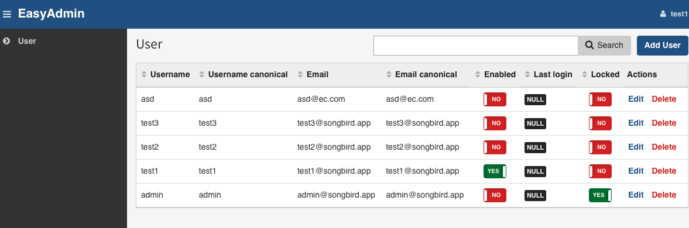

# Chapter 9: The Admin Panel Part 1

We have used FOSUserBundle to create a User CRUD in the previous chapters. It's looking ugly at the moment but its functional. However, anyone can access the user management if they have the right url. We need an admin area where administrators can login and manage the users. All administrative activities should happen behind the admin url, something along the lines of /admin/users for example.

Again, we will try to simplify the process by reusing a 3rd party module that others have created. [SonataAdmin](https://github.com/sonata-project/SonataAdminBundle) and [EasyAdmin](https://github.com/javiereguiluz/EasyAdminBundle) are quite popular at the moment. SonataAdmin is more advanced but more complex to setup. In this book, we will be using EasyAdmin to build the admin panel.

It wouldn't be fun if we just use the ready made solution. In this and the next few chapters, we will attempt to build up the admin area bit by bit.

## Install EasyAdminBundle

As usual, let us add the required bundles in the composer.json file

```
-> scripts/composer require javiereguiluz/easyadmin-bundle ^1.16.5
```

and remember to activate the required bundles in AppKernel.php

```
# app/AppKernel.php
...
    public function registerBundles()
    {
        $bundles = array(
            // ...
            new JavierEguiluz\Bundle\EasyAdminBundle\EasyAdminBundle(),
        );
    }
...
```

Create a new easyadmin config file

```
# app/config/easyadmin/user.yml

easy_admin:
    entities:
        User:
            class: AppBundle\Entity\User

```

The main config file then needs to load everything under the easyadmin folder

```
# app/config/config.yml
imports:
    - { resource: parameters.yml }
    - { resource: security.yml }
    - { resource: services.yml }
    - { resource: easyadmin/ }
...
```
and routing file

```
# app/config/routing.yml
...
easy_admin_bundle:
    resource: "@AppBundle/Controller/AdminController.php"
    type:     annotation
    prefix:   /admin
```

If everything goes well, there will be new routes added

```
-> scripts/console debug:router | grep admin
   easyadmin                        ANY        ANY      ANY    /admin/
   admin                            ANY        ANY      ANY    /admin/
```

We will install the default styles from the bundle

```
-> scripts/console assets:install --symlink
```

Say for now, we want ROLE_USER to access the admin dashboard.

```
# app/config/security.yml
...
    access_control:
        - { path: ^/login$, role: IS_AUTHENTICATED_ANONYMOUSLY }
        # We do not allow user registration
        # - { path: ^/register, role: IS_AUTHENTICATED_ANONYMOUSLY }
        - { path: ^/resetting, role: IS_AUTHENTICATED_ANONYMOUSLY }
        - { path: ^/admin/, role: ROLE_USER }
```

Let us create the new admin controller

```
#src/AppBundle/Controller/AdminController.php
namespace AppBundle\Controller;

use JavierEguiluz\Bundle\EasyAdminBundle\Controller\AdminController as BaseAdminController;

class AdminController extends BaseAdminController
{
    public function createNewUserEntity()
    {
        return $this->get('fos_user.user_manager')->createUser();
    }

    public function prePersistUserEntity($user)
    {
        $this->get('fos_user.user_manager')->updateUser($user, false);
    }

    public function preUpdateUserEntity($user)
    {
        $this->get('fos_user.user_manager')->updateUser($user, false);
    }
}
```

Now, try logging in

```
http://songbird.app:8000/app_dev.php/admin
```

By default, the admin page requires ROLE_ADMIN and above (see app/config/security.yml). So let us login as the administrator

```
username: admin
password: admin
```

wow, we can now see the admin dashboard. If you have accidentally deleted or modified the admin user, remember that you can reset the db with `scripts/resetapp`.



Looks pretty empty huh?

## Services

services.yml is important because that is where we define reusable components. Let us create a dummy one for now.

```
# src/AppBundle/Resources/config/services.yml

services:
    # note that this name is important. Its how we reference the class throughout the site.
```

Next, we need to create the a yml [service extension](http://symfony.com/doc/current/cookbook/bundles/extension.html) and the configuration class so that the framework can load it during the bootstrap.

```
-> mkdir -p src/AppBundle/DependencyInjection
-> touch src/AppBundle/DependencyInjection/AppExtension.php
```

and AppExtensions.php contains

```
# src/AppBundle/DependencyInjection/AppExtension.php

namespace AppBundle\DependencyInjection;

use Symfony\Component\DependencyInjection\ContainerBuilder;
use Symfony\Component\Config\FileLocator;
use Symfony\Component\HttpKernel\DependencyInjection\Extension;
use Symfony\Component\DependencyInjection\Loader\YamlFileLoader;

/**
* This is the class that loads and manages your bundle configuration
*
* To learn more see {@link http://symfony.com/doc/current/cookbook/bundles/extension.html}
*/
class AppExtension extends Extension
{
    /**
     * {@inheritdoc}
     */
    public function load(array $configs, ContainerBuilder $container)
    {
        $configuration = new Configuration();
        $config = $this->processConfiguration($configuration, $configs);

        $loader = new YamlFileLoader($container, new FileLocator(__DIR__ . '/../Resources/config'));
        $loader->load('services.yml');
    }
}
```

now the configuration file

```
# src/AppBundle/DependencyInjection/Configuration.php

namespace AppBundle\DependencyInjection;

use Symfony\Component\Config\Definition\Builder\TreeBuilder;
use Symfony\Component\Config\Definition\ConfigurationInterface;

/**
 * This is the class that validates and merges configuration from your app/config files
 *
 */
class Configuration implements ConfigurationInterface
{
    /**
     * {@inheritdoc}
     */
    public function getConfigTreeBuilder()
    {
        $treeBuilder = new TreeBuilder();
        $treeBuilder->root('app');

        // Here you should define the parameters that are allowed to
        // configure your bundle. See the documentation linked above for
        // more information on that topic.

        return $treeBuilder;
    }
}
```

## Filtering the User fields

The user table has many fields. Remember that you specified what fields you want to display in src/AppBundle/Form/UserType.php? By using EasyAdmin, the creation of forms is now managed by the config. It should be self explanatory. Let us modify the fields.

```
# app/config/easyadmin/user.yml

easy_admin:
    entities:
        User:
            class: AppBundle\Entity\User
            label: 'User Management'
            # for new user
            new:
                fields:
                  - username
                  - firstname
                  - lastname
                  - { property: 'plainPassword', type: 'repeated', type_options: { type: 'Symfony\Component\Form\Extension\Core\Type\PasswordType', first_options: {label: 'Password'}, second_options: {label: 'Repeat Password'}, invalid_message: 'The password fields must match.'}}
                  - { property: 'email', type: 'email', type_options: { trim: true } }
                  - roles
                  - enabled
            edit:
                  actions: ['-delete', '-list']
                  fields:
                    - username
                    - firstname
                    - lastname
                    - { property: 'plainPassword', type: 'repeated', type_options: { type: 'Symfony\Component\Form\Extension\Core\Type\PasswordType', required: false, first_options: {label: 'Password'}, second_options: {label: 'Repeat Password'}, invalid_message: 'The password fields must match.'}}
                    - { property: 'email', type: 'email', type_options: { trim: true } }
                    - roles
                    - enabled
            show:
                  actions: ['edit', '-delete', '-list']
                  fields:
                    - id
                    - username
                    - firstname
                    - lastname
                    - email
                    - roles
                    - enabled
                    - locked
                    - expired
                    - { property: 'last_login', type: 'datetime' }
                    - modified
                    - created
            list:
                title: 'User Listing'
                actions: ['show']
                fields:
                  - id
                  - username
                  - email
                  - firstname
                  - lastname
                  - enabled
                  - roles
                  - { property: 'last_login', type: 'datetime' }
```

Thanks to easyadmin, we have just created CRUD with this yaml file. We have trimmed down all the fields to include only the relevant ones. Note the plainPassword field - We have created 2 password fields with just a simple configuration.

Navigate the site and make sure they are looking good. Looking at mysql, you can see that the password has also been encrypted correctly, indicating that the AdminController's preUpdate function is working.

## Redirecting Users to Dashboard After Login

Easy.

```
# app/config/security.yml
...
    firewalls:
        main:
            pattern: ^/
            form_login:
                provider: fos_userbundle
                csrf_provider: security.csrf.token_manager
                default_target_path: /admin
                ...
```

## User Roles and Security

What if we want ROLE_USER to login to /admin but restrict them to certain areas only?

We need to subscribe to some events so that we can add some rules based on user's role. Remember the services.yml? It will save the day.

```
# src/AppBundle/Resources/services.yml

services:

    app.subscriber:
            class: AppBundle\EventListener\AppSubscriber
            arguments:
                - "@service_container"
            tags:
                - { name: kernel.event_subscriber }
```

Let's now create the AppSubscriber class

```
# src/AppBundle/EventListener/AppSubscriber.php

namespace AppBundle\EventListener;

use Symfony\Component\EventDispatcher\EventSubscriberInterface;
use Symfony\Component\EventDispatcher\GenericEvent;
use Symfony\Component\Security\Core\Exception\AccessDeniedException;
use JavierEguiluz\Bundle\EasyAdminBundle\Event\EasyAdminEvents;
use Symfony\Component\DependencyInjection\ContainerInterface;

class AppSubscriber implements EventSubscriberInterface
{
    protected $container;

    /**
     * AppSubscriber constructor.
     * @param ContainerInterface $container
     */
    public function __construct(ContainerInterface $container) // this is @service_container
    {
        $this->container = $container;
    }

    /**
     * @return array
     */
    public static function getSubscribedEvents()
    {
        // return the subscribed events, their methods and priorities
        return array(
            EasyAdminEvents::PRE_LIST => 'checkUserRights',
            EasyAdminEvents::PRE_EDIT => 'checkUserRights',
            EasyAdminEvents::PRE_SHOW => 'checkUserRights',
            EasyAdminEvents::PRE_NEW => 'checkUserRights',
            EasyAdminEvents::PRE_DELETE => 'checkUserRights'
        );
    }

    /**
     * show an error if user is not superadmin and tries to manage restricted stuff
     *
     * @param GenericEvent $event event
     * @return null
     * @throws AccessDeniedException
     */
    public function checkUserRights(GenericEvent $event)
    {

        // if super admin, allow all
        if ($this->container->get('security.authorization_checker')->isGranted('ROLE_SUPER_ADMIN')) {
            return;
        }

        $entity = $this->container->get('request_stack')->getCurrentRequest()->query->get('entity');
        $action = $this->container->get('request_stack')->getCurrentRequest()->query->get('action');
        $user_id = $this->container->get('request_stack')->getCurrentRequest()->query->get('id');

        // if user management, only allow ownself to edit and see ownself
        if ($entity == 'User') {
            // if edit and show
            if ($action == 'edit' || $action == 'show') {
                // check user is himself
                if ($user_id == $this->container->get('security.token_storage')->getToken()->getUser()->getId()) {
                    return;
                }
            }
        }

        // throw exception in all cases
        throw new AccessDeniedException();
    }
}
...
```

Basically, we have created a checkUserRights function to ensure that other than the super admin, only the rightful owner can edit and see his own profile only.

Try logging in as test1:test1 (user id = 2) and see own profile

```
http://songbird.app:8000/app_dev.php/admin/?action=show&entity=User&id=2
```

If test1 tries to see other people's profile, we should get an access denied error.

```
http://songbird.app:8000/app_dev.php/admin/?action=show&entity=User&id=3
```

User list url should give us access denied as well.

```
http://songbird.app:8000/app_dev.php/admin/?action=list&entity=User
```

There is one more thing we need to clean up. If I login as ROLE_USER, I should not be able to see certain fields.

Under the "edit" action, I should not see the roles, enabled, locked, and expired fields.

Under the "show" action, I should not see the created field. User should also be redirected to the show page when the details are updated.

```
# src/AppBundle/Controller/AdminController.php
    ....
     /**
      * when edit user action
      * 
      * @return Response|\Symfony\Component\HttpFoundation\RedirectResponse|\Symfony\Component\HttpFoundation\Response
      */
     protected function editUserAction()
     {
         $id = $this->request->query->get('id');
         $easyadmin = $this->request->attributes->get('easyadmin');
         $entity = $easyadmin['item'];
 
         if ($this->request->isXmlHttpRequest() && $property = $this->request->query->get('property')) {
             $newValue = 'true' === strtolower($this->request->query->get('newValue'));
             $fieldsMetadata = $this->entity['list']['fields'];
 
             if (!isset($fieldsMetadata[$property]) || 'toggle' !== $fieldsMetadata[$property]['dataType']) {
                 throw new \RuntimeException(sprintf('The type of the "%s" property is not "toggle".', $property));
             }
 
             $this->updateEntityProperty($entity, $property, $newValue);
 
             return new Response((string)$newValue);
         }
 
         $fields = $this->entity['edit']['fields'];
 
         $editForm = $this->createEditForm($entity, $fields);
         if (!$this->isGranted('ROLE_SUPER_ADMIN')) {
             $editForm->remove('enabled');
             $editForm->remove('roles');
             $editForm->remove('locked');
             $editForm->remove('expired');
         }
 
         $deleteForm = $this->createDeleteForm($this->entity['name'], $id);
 
         $editForm->handleRequest($this->request);
         if ($editForm->isValid()) {
             $this->preUpdateUserEntity($entity);
             $this->em->flush();
 
             $refererUrl = $this->request->query->get('referer', '');
 
             return !empty($refererUrl)
                 ? $this->redirect(urldecode($refererUrl))
                 : $this->redirect($this->generateUrl('easyadmin', array('action' => 'show', 'entity' => $this->entity['name'], 'id' => $id)));
         }
 
         return $this->render($this->entity['templates']['edit'], array(
             'form' => $editForm->createView(),
             'entity_fields' => $fields,
             'entity' => $entity,
             'delete_form' => $deleteForm->createView(),
         ));
     }
```

Easyadmin allows creation of isolated entity functions like "editUserAction". This is brilliant because updating this function won't affect other entities.

## Cleaning up

Since we are not going to use FOSUserBundle /profile url to change update user profile, let us remove it from the routing.yml

```
# app/config/routing.yml

#fos_user_profile:
#    resource: "@FOSUserBundle/Resources/config/routing/profile.xml"
#    prefix: /profile

#fos_user_change_password:
#    resource: "@FOSUserBundle/Resources/config/routing/change_password.xml"
#    prefix: /profile
```

Now let us do some cleaning up. Since we are now using EasyAdmin, a lot of files that we have generated using the command line are no longer needed. As you can see, automation is only good if you know what you are doing.

```
git rm src/AppBundle/Controller/UserController.php
git rm src/AppBundle/Form/UserType.php
git rm -rf app/Resources/views/default
git rm -rf src/AppBundle/Tests/Controller/UserControllerTest.php
git rm -rf src/AppBundle/Tests/Controller/DefaultControllerTest.php
# All efforts gone? Don't worry, we will write new tests in the next chapter
git rm -rf tests
git rm codeception.yml
# add all changes
git add .
```

## Summary

We have installed a popular Admin system called EasyAdminBundle. We then integrated FOSUserBundle with EasyAdminBundle and customised some fields. We have also configured the security of the system such that unless the logged in user is a super admin, the user can only see or update his own profile.

Remember to commit your changes before moving on to the next chapter.

## Exercises

* Try installing the [SonataAdminBundle](https://sonata-project.org/bundles/admin/master/doc/index.html) yourself and see the differences in both approach.

## References

* [EasyAdminBundle](https://github.com/javiereguiluz/EasyAdminBundle)

* [EasyAdminBundle and FOSUserBundle Integration](https://github.com/javiereguiluz/EasyAdminBundle/blob/master/Resources/doc/tutorials/fosuserbundle-integration.md)

* [EasyAdminBundle views configuration](https://github.com/javiereguiluz/EasyAdminBundle/blob/master/Resources/doc/book/4-edit-new-configuration.md#customizing-the-behavior-of-edit-and-new-views)

* [Event Listener and Subscribers](https://symfony.com/doc/current/doctrine/event_listeners_subscribers.html)
